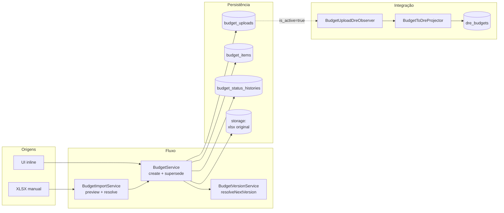

# 01 — Arquitetura do Módulo Orçamentos (Budgets)

> Audiência: desenvolvedores e mantenedores. Para uso, veja
> [02 — Manual do administrador](02-administrador.md) e
> [03 — Manual do usuário final](03-usuario-final.md).

---

## Sumário

1. [Visão geral](#1-visão-geral)
2. [Modelo de dados](#2-modelo-de-dados)
3. [Versionamento semântico](#3-versionamento-semântico)
4. [Wizard de upload](#4-wizard-de-upload)
5. [Edição inline](#5-edição-inline)
6. [Soft delete e lixeira](#6-soft-delete-e-lixeira)
7. [Integração com DRE](#7-integração-com-dre)
8. [Dashboard e consumo](#8-dashboard-e-consumo)
9. [Comparação entre versões](#9-comparação-entre-versões)
10. [Pontos de extensão](#10-pontos-de-extensão)

---

## 1. Visão geral



**Princípios:**

1. **Imutabilidade lógica + edição prática.** Um upload não muda de versão
   uma vez gravado, mas seus itens podem ser editados inline (com audit
   log preservando histórico).
2. **Uma versão ativa por (year, scope_label).** Ativar uma desativa
   automaticamente a anterior — superseding.
3. **Projeção idempotente para DRE.** Reativar produz o mesmo estado.
4. **Storage do XLSX original** para auditoria — sempre é possível baixar
   o arquivo cru via `/budgets/{id}/download`.

---

## 2. Modelo de dados

### `budget_uploads` (BudgetUpload)

Cabeçalho da versão.

| Campo | Tipo | Observação |
|---|---|---|
| `year` | int | 2026, 2027… |
| `scope_label` | string(100) | Identificador lógico ("Administrativo", "TI", "Geral") |
| `area_department_id` | FK management_classes? | Sintético `8.1.DD` (Fase 5) |
| `version_label` | string | "1.0", "1.01", "2.0" — compilado |
| `major_version` | int | NOVO incrementa |
| `minor_version` | int | AJUSTE incrementa |
| `upload_type` | enum | `NOVO` ou `AJUSTE` |
| `is_active` | bool | Default `false`. **Uma ativa por (year, scope_label)** |
| `total_year` | decimal | Cache da soma dos 12 meses |
| `items_count` | int | Cache da contagem de items |
| `notes` | text? | Observações livres |
| `xlsx_path` | string? | Path em storage do arquivo original |
| `created_by` | FK users | Quem subiu |
| `deleted_at` | datetime? | Soft delete |
| `deleted_by_user_id` | FK users? | Quem excluiu |
| `deleted_reason` | text? | Motivo da exclusão |

**Traits:** `Auditable` (registra mudanças no activity_log), `InvalidatesDreCacheOnChange`.

**Indexes críticos:**
- `(year, scope_label, is_active)` — sustenta lookup da versão ativa
- `(deleted_at)` — separa lixeira

### `budget_items` (BudgetItem)

Linha do orçamento — uma conta + CC + 12 valores.

| Campo | Tipo | Observação |
|---|---|---|
| `budget_upload_id` | FK | Versão a que pertence |
| `accounting_class_id` | FK chart_of_accounts | Conta contábil **analítica** |
| `management_class_id` | FK management_classes? | Plano gerencial (opcional) |
| `cost_center_id` | FK cost_centers | CC alvo |
| `store_id` | FK stores? | NULL para corporativo |
| `month_01_value` … `month_12_value` | decimal(15,2) | Valor por mês |
| `year_total` | decimal(18,2) | Calculado via `computeYearTotal()` |
| `supplier` | string? | Fornecedor previsto |
| `justification` | text? | Justificativa |
| `account_description` | string? | Descrição customizada da conta |
| `class_description` | string? | Descrição customizada da classe |

**Trait:** `Auditable` (cada edição inline registrada).

### `budget_status_histories` (BudgetStatusHistory)

Audit trail dedicado — eventos relevantes de cada upload.

| Campo | Tipo | Observação |
|---|---|---|
| `budget_upload_id` | FK | |
| `event` | string | `created`, `activated`, `deactivated`, `deleted`, `restored` |
| `actor_user_id` | FK users? | |
| `notes` | text? | |
| `metadata` | json? | Snapshot relevante do estado |

### `dre_budgets` (DreBudget — projeção)

Veja [DRE — 01 Arquitetura, §3.2](../dre/01-arquitetura.md#32-dre_budgets).
**Não é gravado por mão** — populado por `BudgetToDreProjector` quando
`BudgetUpload.is_active=true`.

---

## 3. Versionamento semântico

### Regra

`BudgetVersionService::resolveNextVersion(year, scopeLabel, uploadType)` retorna
`(major, minor, label)`:

| Cenário | Resultado |
|---|---|
| Primeiro upload do `(year, scope)` | `1.0` |
| `upload_type = NOVO`, último era `1.05` | `2.0` (incrementa major, zera minor) |
| `upload_type = AJUSTE`, último era `1.05` | `1.06` (incrementa minor) |
| Primeiro upload de `year+1` | `1.0` (reset por ano) |
| Versões deletadas | Ignoradas — calcula sobre não-deletados |

### Quando usar NOVO × AJUSTE

- **NOVO** — substituição completa. Caso típico: o orçamento foi
  re-feito do zero (novo cenário, mudança estratégica). Todas as linhas
  da versão anterior são substituídas.
- **AJUSTE** — refinamento incremental. Mesmas linhas, valores ajustados.
  Para o usuário, conceitualmente "versão patch".

A diferença é **rastreabilidade** — não há comportamento técnico distinto.

---

## 4. Wizard de upload

`resources/js/Pages/Budgets/components/BudgetUploadWizard.jsx` (33 KB, 3 steps).

### Step 1 — `upload`

```
POST /budgets/preview
     file: <xlsx>
     → BudgetImportService::preview(filePath)
       → parse XLSX
       → normaliza headers (HEADER_MAP, 35+ aliases)
       → fuzzy-match FKs ausentes
       → retorna diagnóstico:
         {
           rows_total, rows_valid, rows_pending, rows_rejected,
           missing_accounts: [{code, fuzzy_suggestions[]}],
           missing_cost_centers: [...],
           ...
         }
```

**Fuzzy match:** Levenshtein distance ≤ min(3, 30% × tamanho do código).
Se XLSX tem `5.2.01` e plano tem `5.2.0.01.00001`, a sugestão sai aproximada
para revisão humana.

### Step 2 — `reconcile`

UI mostra dropdowns para cada FK ausente, com as sugestões fuzzy
pré-selecionadas. Usuário aceita/troca.

### Step 3 — `confirm`

Usuário preenche:
- `year`, `scope_label`
- `area_department_id` (Fase 5)
- `upload_type` (NOVO / AJUSTE)
- `notes`

```
POST /budgets/import
     mapping: {...}, file: <xlsx>, year, scope_label, upload_type, notes
     → BudgetImportService::resolveItems(file, mapping)
     → BudgetService::create(data, items, file, actor)
       → BudgetVersionService::resolveNextVersion(year, scope, type)
       → desativa anterior do mesmo (year, scope)
       → INSERT budget_uploads (is_active=true)
       → INSERT N budget_items
       → INSERT budget_status_histories (event=created)
       → STORE XLSX original em storage
       → Observer dispara BudgetToDreProjector
```

---

## 5. Edição inline

`PATCH /budget-items/{id}` (`BudgetItemController::update`).

Fluxo:
1. Validation: campos editáveis (`supplier`, `justification`, `month_*_value`,
   `account_description`, `class_description`)
2. UPDATE no item
3. **Recalcula `year_total`** (`item->computeYearTotal()`)
4. **Recalcula totais do upload pai** (`upload->total_year`, `items_count`)
5. Auditable trait registra diff antes/depois automaticamente
6. **Não dispara reprojeção em DRE imediatamente** — observer só refaz se
   `is_active` mudar. **Para refletir edição na DRE**, é preciso reativar o
   upload (ou o cache expira em 10min e o compute live pega o novo valor)

> **Gotcha:** edição inline em upload **inativo** não afeta DRE até reativar.

---

## 6. Soft delete e lixeira

### Soft delete

`DELETE /budgets/{id}` exige `deleted_reason` no body. Marca:
- `deleted_at = now()`
- `deleted_by_user_id = actor`
- `deleted_reason = body['reason']`

**Não desativa imediatamente.** Se o upload era ativo:
1. Desativa (`is_active=false`)
2. **Apaga** as linhas correspondentes em `dre_budgets`
3. Registra `BudgetStatusHistory` (`event=deleted`)

### Lixeira

`GET /budgets/trash` lista soft-deletados, com filtros.

### Restore

`POST /budgets/{id}/restore`:
- `deleted_at = NULL`
- `deleted_by_user_id = NULL`
- `deleted_reason = NULL`
- **`is_active` permanece `false`** — restore não reativa automaticamente

Para reativar após restore: usuário deve abrir a versão e clicar "Ativar"
manualmente (que dispara superseding normal).

### Force delete

`DELETE /budgets/{id}/force` — apenas SUPER_ADMIN. Hard delete (apaga
fisicamente). Auditado.

---

## 7. Integração com DRE

### Observer

`app/Observers/BudgetUploadDreObserver.php`:

| Evento | Condição | Ação |
|---|---|---|
| `created` | `is_active=true` | `BudgetToDreProjector::project()` |
| `updated` | `is_active` virou `true` | `project()` |
| `updated` | `is_active` virou `false` | `unproject()` (apaga `dre_budgets` desse upload) |
| `deleting` | `is_active=true` | `unproject()` |

### `BudgetToDreProjector::project(BudgetUpload)`

1. Pré-carrega `account_group` de todas as contas referenciadas
2. **Apaga `dre_budgets` de uploads anteriores** do mesmo
   `(year, scope_label)` — superseding
3. Para cada `BudgetItem`, para cada mês com valor não-zero:
   - Resolve sinal por `account_group` (3=+, 4/5=-, 1/2=skip+log)
   - Cria 1 linha em `dre_budgets`:
     - `entry_date = first day of month`
     - `amount = signed value`
     - `budget_version = version_label`
     - `budget_upload_id = upload->id` (FK)
4. Bulk insert em batches de 500

**Idempotência:** delete-then-insert. Reprojetar produz o mesmo estado.

---

## 8. Dashboard e consumo

`GET /budgets/{id}/dashboard` → Inertia render `Budgets/Dashboard.jsx`.
Service: `BudgetConsumptionService::getConsumption(budget)`.

Retorno:
```php
[
    'totals' => [
        'forecast'  => float,  // soma year_total dos items
        'committed' => float,  // OPs não-deletadas (status != cancelled) que apontam para items deste upload
        'realized'  => float,  // committed onde status=done
    ],
    'by_item'           => [...],  // mesma estrutura por item
    'by_cost_center'    => [...],
    'by_accounting_class' => [...],
    'by_month'          => [...],  // matriz de 12 meses × 3 métricas
]
```

**Polling:** `GET /budgets/{id}/consumption` retorna o mesmo JSON sem
re-renderizar a página — útil para refresh manual no dashboard.

### Alertas

Command `budgets:alert` (sugestão de schedule: dailyAt 09:00):

1. Para cada `BudgetUpload.is_active`:
2. Para cada CC alocado:
   - `utilization = realized / forecast`
   - Se ≥ 70% → adiciona warning
   - Se ≥ 100% → adiciona exceeded
3. Notifica via `BudgetAlertNotification` os usuários com permission
   `budgets.view_consumption`

---

## 9. Comparação entre versões

`GET /budgets/compare?v1=X&v2=Y` → `BudgetDiffService::diff(v1, v2)`.

Compara linha-a-linha (matched por `(accounting_class, cost_center, store)`):

- **Adicionados** (existem em v2, não em v1)
- **Removidos** (existem em v1, não em v2)
- **Alterados** (mesma chave, valores mensais diferentes)
- **Inalterados** (omitidos do output para performance)

UI: `Pages/Budgets/Compare.jsx` renderiza lado-a-lado com destaque visual.

---

## 10. Pontos de extensão

### Para adicionar nova coluna ao XLSX

1. Adicione alias em `BudgetImportService::HEADER_MAP`
2. Adicione validação no `resolveItems()`
3. Adicione campo na migration `budget_items`
4. Adicione mapping na `BudgetService::create()`
5. Atualize `BudgetController::template()` para incluir no XLSX exemplo

### Para adicionar novo `event` em status_history

1. Adicione lugar de origem da mudança (controller/service)
2. Insere `BudgetStatusHistory::create([...])` lá
3. (Opcional) Documente no manual

### Gotchas conhecidos

- **Edição inline em upload inativo** não afeta DRE até reativar.
- **`BudgetVersionService` ignora versões deletadas** ao calcular próxima.
  Restaurar uma versão antiga **não muda** o cálculo (versão restaurada
  fica como `is_active=false`).
- **`area_department_id` (Fase 5)** ainda é nullable nas migrations
  legadas — uploads antigos não têm. Validação no controller exige para
  novos uploads, mas a coluna não é NOT NULL ainda (migration pendente).
- **Storage do XLSX original** vai para `storage/app/budget-uploads/`. Em
  produção, monitorar tamanho do disco.

---

## Referências

- Código:
  - `app/Models/Budget*.php`, `app/Models/DreBudget.php`
  - `app/Services/Budget*.php`
  - `app/Services/DRE/BudgetToDreProjector.php`
  - `app/Observers/BudgetUploadDreObserver.php`
  - `app/Http/Controllers/BudgetController.php`, `BudgetItemController.php`
  - `app/Console/Commands/BudgetsAlertCommand.php`
  - `routes/tenant-routes.php` (linhas 1127-1172)
  - `resources/js/Pages/Budgets/`
- Migrations:
  - `database/migrations/tenant/2026_04_20_700001_create_budget_tables.php`
  - `database/migrations/tenant/2026_04_21_100001_add_area_department_id_to_budget_uploads.php`
- Doc relacionada:
  - [`docs/budgets_module.md`](../budgets_module.md) — playbook de implementação
  - [DRE — 01 Arquitetura, §4.2](../dre/01-arquitetura.md#42-quem-grava-em-dre_budgets)

---

> **Última atualização:** 2026-04-22
