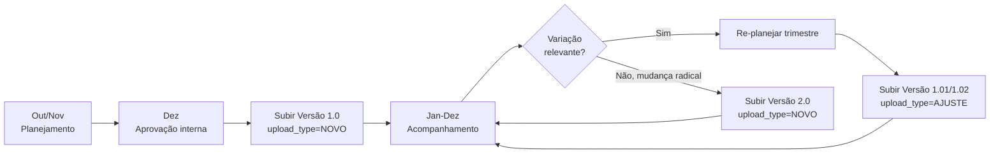

# 02 — Manual do Administrador de Orçamentos

> Audiência: controller, financeiro responsável pelo orçamento.
> Pré-requisito: ter `budgets.upload` + `budgets.manage` ou ser
> SUPER_ADMIN/ADMIN.
> Para conceitos, veja [04 — Glossário](04-glossario.md).
> Para arquitetura, veja [01 — Arquitetura](01-arquitetura.md).

---

## Sumário

1. [Antes de começar](#1-antes-de-começar)
2. [Setup do ciclo anual](#2-setup-do-ciclo-anual)
3. [Subir uma versão (passo a passo)](#3-subir-uma-versão-passo-a-passo)
4. [Ajustes durante o ano (versão NOVO × AJUSTE)](#4-ajustes-durante-o-ano-versão-novo--ajuste)
5. [Edição inline de células](#5-edição-inline-de-células)
6. [Exclusão e restauração (lixeira)](#6-exclusão-e-restauração-lixeira)
7. [Comparação entre versões](#7-comparação-entre-versões)
8. [Alertas de consumo](#8-alertas-de-consumo)
9. [Permissions e responsabilidades](#9-permissions-e-responsabilidades)
10. [Troubleshooting](#10-troubleshooting)

---

## 1. Antes de começar

Pré-requisitos para subir um orçamento:

- **Plano de contas configurado** — todas as contas que aparecerão no XLSX
  precisam existir em `chart_of_accounts`. Ver
  [DRE 02 — Setup, Passo 1](../dre/02-administrador.md#passo-1--importar-o-plano-de-contas).
- **Centros de Custo cadastrados** — idem.
- **Mappings DRE definidos** — sem eles, o orçado vai aparecer em **L99 Não
  Classificado** na matriz. Ver
  [DRE 02 — Setup, Passo 5](../dre/02-administrador.md#passo-5--mapear-contas--linhas-dre-de-para).
- **Arquivo XLSX preparado** — formato detalhado em §3.

> [SCREENSHOT: tela /budgets vazia, antes do primeiro upload]

---

## 2. Setup do ciclo anual

O ciclo de orçamento típico no Mercury:



### Decisões de escopo

Antes do primeiro upload, defina:

1. **Granularidade do `scope_label`.** Opções comuns:
   - `"Geral"` — uma versão única para a empresa toda
   - `"Administrativo"`, `"Comercial"`, `"TI"` — por área (várias versões em
     paralelo)
   - `"Z421"`, `"Z425"` — por loja
2. **Quem aprova cada versão.** Recomendado: documentar em
   `BudgetUpload.notes` o número da reunião/ata de aprovação.
3. **Tipo "AJUSTE" vs "NOVO".** Ajuste = mesma estrutura, valores diferentes.
   Novo = re-planejamento radical. Ver §4.

---

## 3. Subir uma versão (passo a passo)

### 3.1 Preparar o XLSX

Baixe o modelo:

1. Vá em **Financeiro → Orçamentos** (`/budgets`)
2. Clique em **"Baixar modelo"**
3. Abra no Excel — você verá colunas + 2 linhas de exemplo

**Colunas aceitas:**

| Coluna | Obrigatório? | Exemplo | Observação |
|---|---|---|---|
| `codigo_contabil` | Sim | `4.2.1.04.00032` | Conta contábil **analítica** |
| `codigo_gerencial` | Não | `8.1.04.001` | Plano gerencial (se usar) |
| `codigo_centro_custo` | Sim | `421` | CC alvo |
| `codigo_loja` | Não | `Z421` | NULL para corporativo |
| `fornecedor` | Não | "Vivo S/A" | Free text |
| `justificativa` | Não | "Contrato anual TI" | Free text |
| `descricao_conta` | Não | "Telefonia móvel" | Override do nome da conta |
| `descricao_classe` | Não | "Telecom" | Override do nome da classe |
| `jan` … `dez` | Sim | `1500.00` | Valor mensal. Aceita fórmula (`=162+0.04*162`) e formato BR (`1.234,56`) |

**Dica:** o XLSX modelo já vem com 2 linhas de exemplo. Apague-as antes de
subir.

### 3.2 Acessar o wizard

1. Em `/budgets`, clique em **"Novo Orçamento"**
2. Abre o `BudgetUploadWizard` (3 passos)

> [SCREENSHOT: step 1 do wizard com botão de upload]

### 3.3 Step 1 — Upload

1. Selecione o XLSX preparado
2. Clique **"Continuar"**
3. Sistema processa o arquivo:
   - Lê todas as linhas
   - Tenta resolver cada FK (`codigo_contabil`, `codigo_centro_custo`, …)
   - Sugere matches fuzzy quando código não bate exato
4. Você verá um **diagnóstico**:
   - Linhas válidas (resolveram tudo) — verde
   - Linhas pendentes (alguma FK precisa intervenção) — amarelo
   - Linhas rejeitadas (erro irrecuperável) — vermelho

### 3.4 Step 2 — Reconcile

Para cada linha pendente, dropdowns mostram opções:

- **Aceite a sugestão** quando faz sentido
- **Escolha outra opção** no dropdown
- **Ignore a linha** se preferir corrigir o XLSX e refazer

> Comum: códigos com sufixo errado (`5.2.01` vs `5.2.0.01.00001`). Sistema
> sugere a versão completa via fuzzy match. Aceite se for óbvio.

> [SCREENSHOT: step 2 com 3 linhas pendentes e dropdowns abertos]

### 3.5 Step 3 — Confirm

Preencha:

| Campo | Valor |
|---|---|
| **Ano** | `2026` |
| **Escopo** (`scope_label`) | `"Administrativo"` |
| **Área/Departamento** | Plano gerencial sintético (Fase 5) |
| **Tipo de upload** | `NOVO` (primeira vez) |
| **Notas** | "Aprovado em reunião de 15/12/2025, ata #234" |

Clique **"Confirmar e importar"**.

Sistema:
1. Calcula próxima versão (`1.0` se primeira do ano+escopo)
2. Desativa versão anterior do mesmo `(year, scope_label)`, se houver
3. Cria `budget_uploads` (is_active=true) + N `budget_items`
4. Armazena XLSX original em storage
5. Dispara `BudgetToDreProjector` → popula `dre_budgets`
6. Redireciona para `/budgets` com flash de sucesso

> A coluna **Orçado** da matriz DRE atualiza em até 10 minutos (TTL do
> cache) ou imediatamente se você rodar `php artisan dre:warm-cache`.

---

## 4. Ajustes durante o ano (versão NOVO × AJUSTE)

### Quando usar AJUSTE (`1.0 → 1.01 → 1.02`)

Cenário: orçamento foi aprovado em dezembro com R$ 50k para Marketing. Em
março, você renegociou contrato e o valor anual cairá para R$ 42k. Você
quer **ajustar pontualmente**:

1. Baixe XLSX original (`/budgets/{id}/download`)
2. Edite os valores mensais que precisam mudar
3. Suba como `upload_type = AJUSTE`
4. Sistema cria `1.01` (incrementa minor)
5. `1.0` vira `is_active=false` (mas continua na lista)

**Resultado:** comparação entre `1.0` e `1.01` mostra exatamente o que
mudou (`/budgets/compare?v1=...&v2=...`).

### Quando usar NOVO (`1.0 → 2.0`)

Cenário: revisão estratégica em junho. Conselho aprovou re-planejar todas
as áreas, com novos itens e estrutura diferente.

1. Prepare XLSX completamente novo
2. Suba como `upload_type = NOVO`
3. Sistema cria `2.0` (incrementa major, zera minor)
4. `1.x` vira inativa

### Regra prática

| Mudança | Tipo |
|---|---|
| Ajuste de valor em alguns itens, mesma estrutura | **AJUSTE** |
| Novo item adicionado / removido pontualmente | **AJUSTE** |
| Re-planejamento completo do orçamento | **NOVO** |
| Nova área (`scope_label` novo) | **NOVO** (primeira do escopo é sempre `1.0`) |

### Cuidado com superseding

**Ativar uma versão desativa todas as anteriores do mesmo escopo.** Se você
subiu `1.05` mas testar mostrar que está errado, a `1.04` ainda existe como
inativa — basta reativá-la (ver §6).

---

## 5. Edição inline de células

Após uma versão estar criada, é possível **editar células diretamente**
sem subir XLSX novo.

### Como

1. Em `/budgets`, abra o detalhe da versão
2. Tabela mostra todos os items
3. Clique numa célula editável: `supplier`, `justification`,
   `month_01_value` … `month_12_value`, `account_description`,
   `class_description`
4. Edite e clique fora (blur) — salva automaticamente
5. `year_total` do item e do upload pai recalculam
6. Audit log registra a mudança (quem, quando, valor antes/depois)

### Cuidados

- **Edições em versão inativa não afetam a DRE** até a versão ser
  reativada. Veja §6.
- **Use audit log** (`/activity-logs`, filtrar `BudgetItem`) para rastrear
  mudanças e questionar autoria.
- **Para mudanças massivas (>20 células)**, prefira subir nova versão por
  XLSX — mais auditável.

---

## 6. Exclusão e restauração (lixeira)

### Excluir (soft delete)

1. Em `/budgets`, na linha da versão, clique no ícone de lixeira
2. Modal pede **motivo da exclusão** (obrigatório, mín 10 chars)
3. Confirme

**O que acontece:**
- `deleted_at` preenchido
- Se a versão estava ativa: `is_active=false` + `dre_budgets` correspondentes
  são **apagadas**
- Registro vai para `/budgets/trash`

### Restaurar

1. Vá em **Orçamentos → Lixeira** (`/budgets/trash`)
2. Encontre a versão
3. Clique em **"Restaurar"**

**O que acontece:**
- `deleted_at = NULL`
- `is_active permanece false` — restore **não reativa**
- Para reativar, abra a versão e clique em **"Ativar"** (que dispara
  superseding normal — desativa qualquer outra ativa do mesmo escopo)

### Force delete (hard)

Apenas SUPER_ADMIN. Apaga fisicamente. Use apenas em casos de:
- Dados sensíveis vazados
- Lixo histórico que polui auditoria

```bash
# Via UI (botão na lixeira) ou via tinker:
php artisan tinker
>>> BudgetUpload::withTrashed()->find($id)->forceDelete();
```

---

## 7. Comparação entre versões

Útil para auditar mudanças entre revisões do mesmo orçamento.

### Como acessar

1. Em `/budgets`, selecione 2 versões (checkbox)
2. Clique em **"Comparar"**
3. URL: `/budgets/compare?v1={X}&v2={Y}`

### O que aparece

Tabela lado-a-lado mostrando:

| Coluna | O que |
|---|---|
| **Adicionados** | Items presentes em v2 e ausentes em v1 — verde |
| **Removidos** | Items presentes em v1 e ausentes em v2 — vermelho |
| **Alterados** | Mesma chave (conta+CC+store), valores mensais diferentes — amarelo, com delta R$ e % |
| **Inalterados** | Omitidos (clique para expandir, se necessário) |

### Caso de uso

Você está apresentando ao conselho a versão `1.05`. Pergunta: "Por que o
gasto de marketing dobrou em junho desde a v1.0 original?". Compare
`1.0 × 1.05`, filtre por `Marketing` na linha de drill, mostre os itens
alterados e quem editou.

> [SCREENSHOT: tela compare com 8 itens alterados, destaque na linha de marketing]

---

## 8. Alertas de consumo

O command `budgets:alert` (sugestão de schedule: `dailyAt 09:00`) varre
versões ativas e notifica usuários com `budgets.view_consumption` quando:

- **Warning** (≥ 70% de utilização): "CC TI já consumiu 73% do orçado anual"
- **Exceeded** (≥ 100%): "CC Marketing **estourou** o orçado anual em 8%"

Notificação via canal `mail` + `database`.

### Configurar

Adicionar no `routes/console.php`:

```php
Schedule::command('budgets:alert')->dailyAt('09:00');
```

Ou rodar manualmente:

```bash
php artisan budgets:alert --year=2026
php artisan budgets:alert --year=2026 --dry-run  # só simula, não envia
```

---

## 9. Permissions e responsabilidades

| Permission | Quem deve ter |
|---|---|
| `budgets.view` | Todos consumidores (gerente, sócio, controller) |
| `budgets.upload` | Controller, financeiro |
| `budgets.download` | Quem precisa do XLSX original (auditoria) |
| `budgets.delete` | Controller (com cuidado) |
| `budgets.manage` | Controller sênior, admin SaaS — gestão de lixeira/restore/compare |
| `budgets.export` | Quem prepara material executivo |
| `budgets.view_consumption` | Gerentes responsáveis pelo CC + diretoria |
| `dre.import_budgets` | (CLI) admin SaaS para casos excepcionais |

Atribuição via `/admin/roles-permissions`. ADMIN/SUPER_ADMIN recebem
todas por padrão.

---

## 10. Troubleshooting

### "Subi a versão mas o orçado não aparece na DRE"

**Possíveis causas:**

1. **Cache não atualizou** — aguarde 10 min ou rode
   `php artisan dre:warm-cache`
2. **Mappings ausentes** — as contas usadas no orçamento não têm mapping
   para nenhuma linha DRE. Vá em `/dre/mappings/unmapped` e mapeie. Após
   mapear, o orçado aparece automaticamente.
3. **Versão não ficou ativa** — confirme `is_active=true` na lista. Se
   `false`, ative no botão.
4. **Filtro de versão na matriz** — abra `/dre/matrix` e confirme que o
   filtro **Versão** está selecionado para a versão que você subiu.

### "Sistema não aceita o XLSX — diz que tem códigos inválidos"

Step 1 do wizard mostra fuzzy matches. Causas comuns:
- Código com **espaço extra** ou **caracteres especiais**
- Código de conta **sintética** (precisa ser analítica)
- CC **inexistente** no `cost_centers`
- Loja escrita errada (`421` vs `Z421` vs `0421`)

Solução:
- Use o **bulk paste** dos códigos sugeridos no XLSX modelo
- Crie itens faltantes no `chart_of_accounts` / `cost_centers` antes de subir

### "Quero subir versão para ano que ainda não existe"

Não tem cerimônia — sistema cria automaticamente. Suba o XLSX com `year=2027`,
escopo desejado, `upload_type=NOVO` → versão sai como `1.0` para `(2027,
escopo)`.

### "Editei várias células e quero reverter"

Audit log (`/activity-logs`, filtrar `BudgetItem`) mostra os valores
anteriores. Edite manualmente para voltar — não há "undo" automático.

Em massa: melhor **subir nova versão** (`AJUSTE`) com os valores corretos
e ativá-la (a versão "errada" vira inativa).

### "Reativei uma versão antiga restaurada e os números não mudam"

Cache. Aguarde TTL ou rode `dre:warm-cache`.

### "Quero entender por que o `1.06` foi gerado mas eu subi um NOVO"

Sistema lê `upload_type` enviado pelo wizard. Verifique:
- O wizard envia `upload_type` corretamente? (DevTools → Network)
- Você marcou o radio button errado no Step 3?

Se confirmado bug, reportar. Workaround: edite manualmente
`budget_uploads.upload_type` (use `tinker` em produção com cuidado).

### "O command `budgets:alert` não está rodando"

Confirme:
1. Schedule está em `routes/console.php`
2. `php artisan schedule:run` está no cron do servidor (a cada minuto)
3. Logs em `storage/logs/laravel-YYYY-MM-DD.log` mostram tentativas

Para forçar execução:
```bash
php artisan budgets:alert
```

---

## Referência rápida

**Subir versão completa em 3 cliques:**
1. `/budgets` → "Novo Orçamento" → upload XLSX
2. Reconcile FKs ausentes
3. Confirmar metadados → importar

**Ver consumo de uma versão:**
- `/budgets/{id}/dashboard`

**Comparar 2 versões:**
- Selecionar checkbox + "Comparar"

**Comandos CLI:**
```bash
php artisan budgets:alert                       # alerta hoje
php artisan dre:import-budgets <path> --version=2026.v1   # excepcional
php artisan dre:warm-cache                      # forçar update DRE
```

---

> **Última atualização:** 2026-04-22
