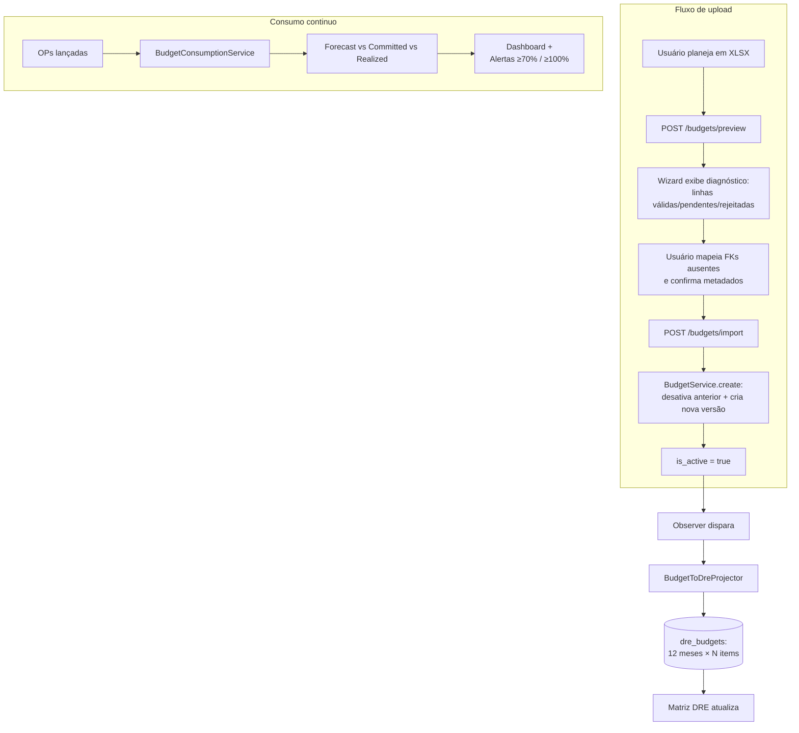

# Módulo Orçamentos (Budgets) — Documentação

Esta pasta concentra a documentação **orientada ao produto pronto** do módulo
de Orçamentos do Mercury, que alimenta a coluna **Orçado** da
[DRE Gerencial](../dre/README.md).

> [SCREENSHOT: tela /budgets com cards de versão ativa]

---

## Para quem é cada documento

| Documento | Para quem | Quando ler |
|---|---|---|
| [01 — Arquitetura](01-arquitetura.md) | Devs, mantenedores | Antes de mexer em código de Budgets ou sua integração com DRE |
| [02 — Manual do administrador](02-administrador.md) | Controller, financeiro | Setup inicial, ciclo anual de orçamento, ajustes (versionamento) |
| [03 — Manual do usuário final](03-usuario-final.md) | Gerente, líder de área, sócio | Para consumir orçamento: comparar versões, acompanhar consumo |
| [04 — Glossário](04-glossario.md) | Todos | Termos do módulo (versão, escopo, item, upload, NOVO×AJUSTE) |

A integração Budgets ⇄ DRE é descrita em
[DRE — 01 Arquitetura, §4.2](../dre/01-arquitetura.md#42-quem-grava-em-dre_budgets).

---

## Visão de uma página

O módulo **Budgets** gerencia orçamentos anuais por escopo. Cada upload é uma
**versão** (ex: `1.0`, `1.01`, `2.0`). Apenas **uma versão ativa por (ano,
escopo)** alimenta a DRE.

---

## Conceitos-chave

| Conceito | Resumo |
|---|---|
| **BudgetUpload** | Cabeçalho de uma versão. Tem ano, escopo, versão (1.0/1.01/2.0), `is_active` |
| **BudgetItem** | Linha de orçamento — uma conta + CC + 12 valores mensais |
| **Escopo (`scope_label`)** | Identificador lógico ("Administrativo", "TI", "Geral") |
| **Versão semântica** | Major (NOVO) e Minor (AJUSTE). Reset a cada ano novo |
| **Superseding** | Ativar uma versão desativa qualquer outra do mesmo `(year, scope)` |
| **Edição inline** | Usuário pode editar células diretamente (com audit completo) |
| **Soft delete + lixeira** | Excluído com motivo vai para `/budgets/trash`. Restore não reativa |

Detalhes em [04 — Glossário](04-glossario.md).

---

## Permissions (8)

| Slug | Para que |
|---|---|
| `budgets.view` | Listar versões ativas e ver detalhes |
| `budgets.upload` | Subir nova versão + editar células inline |
| `budgets.download` | Baixar XLSX original armazenado |
| `budgets.delete` | Soft-delete de versões não-ativas |
| `budgets.manage` | Gerenciar trash, restore, comparar versões |
| `budgets.export` | Exportar consolidado XLSX (6 sheets) |
| `budgets.view_consumption` | Acessar dashboard de consumo |
| `dre.import_budgets` | (CLI) Import alternativo direto em `dre_budgets` |

---

## Rotas principais

| Rota | Para que |
|---|---|
| `/budgets` | Lista (filtros: ano, escopo, tipo) |
| `/budgets/{id}` | Detalhes (json) — usado nos modais |
| `/budgets/{id}/dashboard` | Dashboard de consumo (forecast × committed × realized) |
| `/budgets/{id}/download` | Baixa o XLSX original |
| `/budgets/{id}/export` | Export consolidado (6 sheets) |
| `/budgets/template` | Baixa modelo de XLSX com exemplos |
| `/budgets/preview` | Passo 1 do wizard — preview + fuzzy-match |
| `/budgets/import` | Passo 2 do wizard — persiste a versão |
| `/budgets/compare?v1=X&v2=Y` | Diff lado-a-lado entre 2 versões |
| `/budgets/trash` | Lixeira (soft-deleted) |
| `/budget-items/{id}` | PATCH — edição inline de célula |

---

## Commands agendados

| Command | Schedule sugerido | O que faz |
|---|---|---|
| `budgets:alert [--year=YYYY] [--dry-run]` | Diariamente 09:00 | Notifica VIEW_BUDGET_CONSUMPTION sobre CCs com utilização ≥70% (warning) ou ≥100% (exceeded) |

Sob demanda:
- `dre:import-budgets <path> --version=<label> [--dry-run]` — orçado manual (alternativa ao fluxo via UI)

---

## Atalhos

- **"Como subo um orçamento novo?"** → [02 — §2 Setup do ciclo anual](02-administrador.md#2-setup-do-ciclo-anual)
- **"Quando vira `1.01` vs `2.0`?"** → [04 — Glossário, NOVO × AJUSTE](04-glossario.md#novo--ajuste-upload_type)
- **"O orçado não aparece na DRE"** → [02 — §6 Troubleshooting](02-administrador.md#6-troubleshooting)
- **"Como leio o dashboard?"** → [03 — Usuário final](03-usuario-final.md#5-dashboard-de-consumo)

---

> **Última atualização:** 2026-04-22
