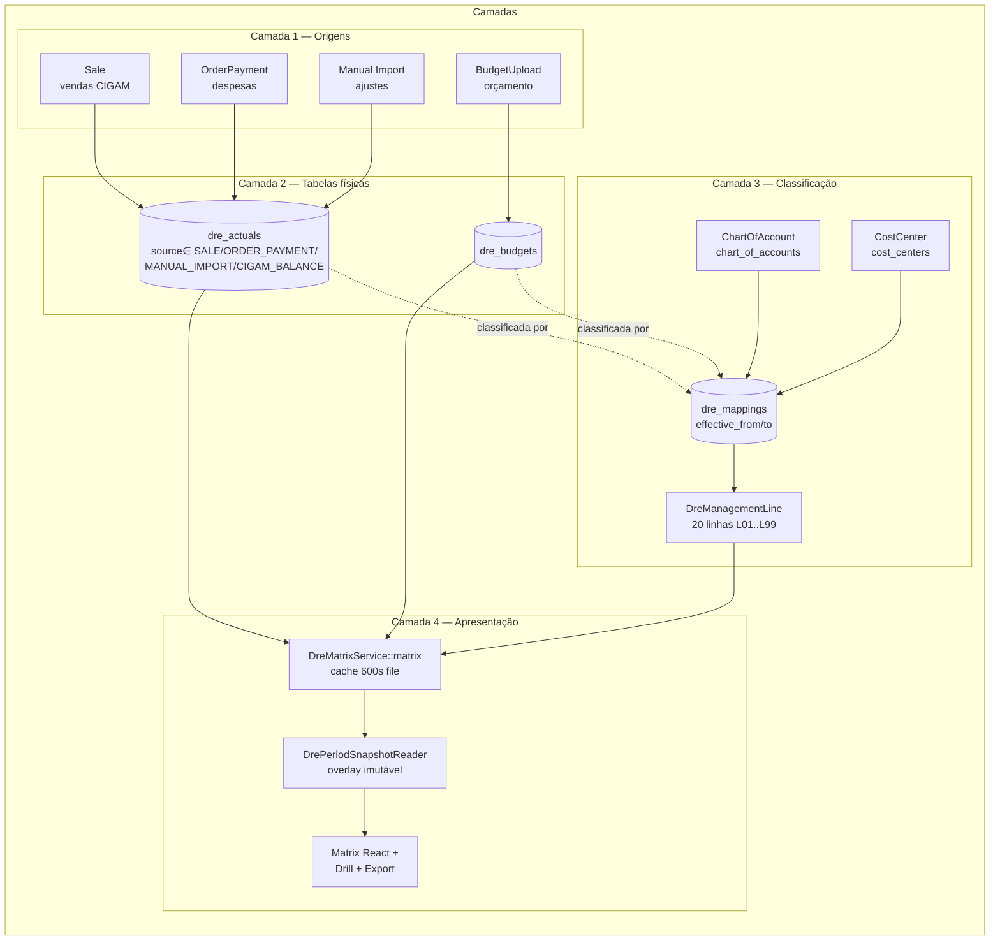
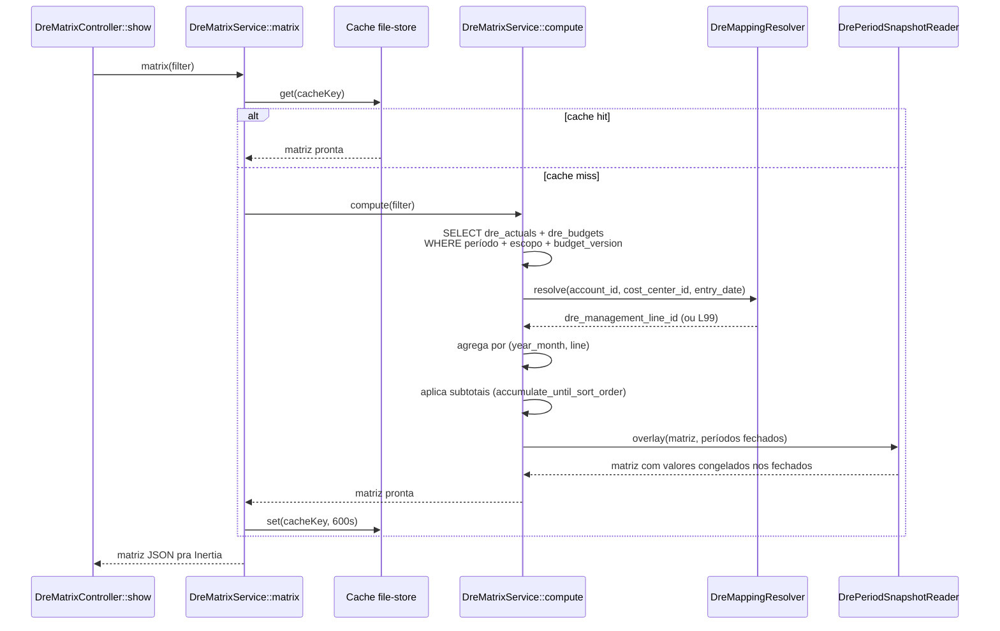
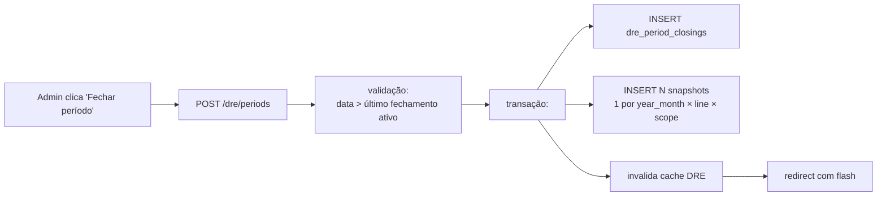

# 01 — Arquitetura do Módulo DRE

> Audiência: desenvolvedores e mantenedores. Para uso operacional, veja
> [02 — Manual do administrador](02-administrador.md) e
> [03 — Manual do usuário final](03-usuario-final.md).

Este documento descreve o **modelo de dados, fluxos de cálculo, integração entre
módulos satélites e pontos de extensão** da DRE Gerencial. Assume familiaridade
com Laravel 12, Eloquent e o stack Mercury (multi-tenant via stancl/tenancy,
Inertia + React no frontend).

---

## Sumário

1. [Visão geral](#1-visão-geral)
2. [Os 5 módulos satélites](#2-os-5-módulos-satélites)
3. [Tabelas centrais da DRE](#3-tabelas-centrais-da-dre)
4. [Origens de lançamento e projetores](#4-origens-de-lançamento-e-projetores)
5. [Convenção de sinal](#5-convenção-de-sinal)
6. [Pipeline de cálculo da matriz](#6-pipeline-de-cálculo-da-matriz)
7. [Fechamento de período](#7-fechamento-de-período)
8. [Cache](#8-cache)
9. [Commands](#9-commands)
10. [Pontos de extensão e gotchas](#10-pontos-de-extensão-e-gotchas)

---

## 1. Visão geral

A DRE Gerencial não é uma tabela única — é uma **agregação calculada** sobre
duas tabelas físicas (`dre_actuals` para realizado, `dre_budgets` para orçado),
classificada por uma estrutura de cinco entidades de configuração e apresentada
em **20 linhas executivas fixas**.

### Princípios

1. **Source of truth não é a matriz**, são `dre_actuals` + `dre_budgets`. A
   matriz é cache.
2. **Cada lançamento é classificado por *(conta contábil + centro de custo)*** —
   não há mapping direto Sale→linha ou OP→linha.
3. **Mappings têm vigência** (`effective_from`/`effective_to`), permitindo
   reorganizar a DRE sem reescrever histórico.
4. **Linhas executivas (`dre_management_lines`) são imutáveis durante a operação**
   — não somem, não mudam de número. O que muda é o que aponta para elas.
5. **Fechamento congela o passado**. Lançamentos retroativos continuam sendo
   projetados em `dre_actuals` mas não alteram a matriz fechada (overlay via
   snapshot).

---

## 2. Os 5 módulos satélites

> [SCREENSHOT: matriz de relação entre os 5 módulos]

### 2.1 CostCenter — `cost_centers`

Hierarquia operacional (loja → setor → departamento). Standalone (não cascateia
para sintéticas contábeis).

| Campo | Tipo | Observação |
|---|---|---|
| `code` | string | Código único; convenção Meia Sola = código numérico de 3 dígitos por loja (`421`, `425`, `457`...) |
| `name` | string | Descrição |
| `parent_id` | FK self | Permite hierarquia |
| `default_accounting_class_id` | FK chart_of_accounts | **Sugerido**, não obrigatório — usado em formulários para pré-popular conta |

**Rotas:** `/cost-centers` (CRUD próprio, fora de `/config`).
**Permissions:** `cost_centers.view|create|edit|delete|manage|import|export`.

### 2.2 ChartOfAccount — `chart_of_accounts`

Plano de contas contábil normativo. Source de **natureza** (débito/crédito) e
de **agrupamento DRE-BR**. Para o tenant Meia Sola, são 839 contas reais
importadas do CIGAM (formato `X.X.X.XX.XXXXX`).

| Campo | Tipo | Observação |
|---|---|---|
| `code` | string | Código contábil completo (`4.2.1.04.00032`) |
| `name` | string | Descrição (`Telefonia`) |
| `type` | enum | `analytical` (folha, recebe lançamentos) ou `synthetic` (agrupadora, não recebe) |
| `account_group` | int | 1=Ativo, 2=Passivo, 3=Receita, 4=Despesa, 5=Custo. **Determina sinal** |
| `parent_id` | FK self | Hierarquia (5 níveis no padrão CIGAM) |

**Apenas contas `analytical` podem receber lançamentos.** Sintéticas existem
para totalização visual no relatório contábil — nunca em `dre_actuals`.

**Rotas:** `/accounting-classes`. Aceita visão lista ou árvore.

### 2.3 ManagementClass — `management_classes`

Visão **interna operacional** ("Salários PJ", "Aluguel Loja", "Propaganda
Mídia Digital"). É um **bridge opcional** — empresa que não usa plano gerencial
mapeia conta contábil → linha DRE direto.

Para Meia Sola: 169 classes no formato `8.1.DD.UU` (DD = departamento, UU = uso).

| Campo | Tipo | Observação |
|---|---|---|
| `code` | string | Código gerencial |
| `name` | string | Descrição interna |
| `accounting_class_id` | FK chart_of_accounts | **Vínculo opcional** com plano contábil |
| `cost_center_id` | FK cost_centers | CC sugerido |

**Hoje, ManagementClass não é consumida pelo motor de cálculo da DRE** — quem
classifica o lançamento na linha é `dre_mappings` lendo *conta contábil + CC*.
ManagementClass existe para permitir relatórios gerenciais alternativos e dar
ao usuário um vocabulário interno mais legível que o código contábil.

**Rotas:** `/management-classes`.

### 2.4 DreManagementLine — `dre_management_lines`

As **20 linhas fixas da DRE executiva**. Estrutura imutável durante operação
(reorganizar exige migração + recálculo).

| Campo | Tipo | Observação |
|---|---|---|
| `code` | string | `L01`, `L02`, …, `L99_UNCLASSIFIED` |
| `name` | string | "Receita Bruta", "Lucro Líquido", … |
| `sort_order` | int | Ordem de exibição |
| `is_subtotal` | bool | Linha derivada (soma das antecedentes até `accumulate_until_sort_order`) |
| `accumulate_until_sort_order` | int? | Quando `is_subtotal=true`, define o limite da soma |
| `nature` | enum | `revenue`, `expense`, `cost`, `subtotal` — para validação de mapping |

**Linha L99_UNCLASSIFIED é especial** — fallback quando `dre_mappings` não
resolve. Aparece em vermelho na matriz para sinalizar contas sem mapping (ver
seção 6).

**Rotas:** `/dre/management-lines` — CRUD com reorder client-side. Permission
`dre.manage_structure`.

### 2.5 DreMapping — `dre_mappings`

O **de-para entre lançamento e linha DRE**. Determina em qual linha cada
lançamento de `dre_actuals` (e `dre_budgets`) aparece.

| Campo | Tipo | Observação |
|---|---|---|
| `chart_of_account_id` | FK chart_of_accounts | **Obrigatório**. Apenas analíticas |
| `cost_center_id` | FK cost_centers | **Opcional**. NULL = "qualquer CC" (coringa) |
| `dre_management_line_id` | FK dre_management_lines | Linha alvo |
| `effective_from` | date | Vigência inicial |
| `effective_to` | date? | Vigência final (NULL = vigente sem fim) |

**Precedência** (`DreMappingResolver::resolve`):

1. Mapping com **mesmo `chart_of_account_id` + mesmo `cost_center_id`** (específico)
2. Mapping com **mesmo `chart_of_account_id` + `cost_center_id IS NULL`** (coringa por conta)
3. Fallback: linha **L99_UNCLASSIFIED**

A janela é considerada válida quando `effective_from <= entry_date AND
(effective_to IS NULL OR effective_to >= entry_date)`.

**Rotas:** `/dre/mappings` (lista + edit inline) e `/dre/mappings/unmapped`
(queue de contas sem mapping). Permission `dre.manage_mappings`.

---

## 3. Tabelas centrais da DRE

### 3.1 `dre_actuals`

Realizado. Cada linha é **um lançamento atômico** já em moeda corrente, com
sinal aplicado.

| Campo | Tipo | Observação |
|---|---|---|
| `entry_date` | date | Data do fato gerador |
| `store_id` | FK stores? | NULL = corporativo/consolidado |
| `chart_of_account_id` | FK | Conta contábil **analítica** |
| `cost_center_id` | FK? | CC opcional |
| `amount` | decimal(18,2) | **Já com sinal aplicado** (ver §5) |
| `source` | enum | `SALE`, `ORDER_PAYMENT`, `MANUAL_IMPORT`, `CIGAM_BALANCE` |
| `source_id` | bigint? | FK para a entidade origem (Sale.id, OrderPayment.id…) — quando aplicável |
| `external_id` | string? | Dedup-key para imports manuais |
| `document` | string? | NF, recibo, contrato — referência humana |
| `description` | string? | Memo livre |

**Indexes críticos:**
- `(entry_date, chart_of_account_id, cost_center_id)` — sustenta a montagem da matriz
- `(source, source_id)` — sustenta `OrderPaymentToDreProjector::removePrior()` etc
- `(source, external_id) UNIQUE` — apenas para `source=MANUAL_IMPORT`, dedup de re-import

### 3.2 `dre_budgets`

Orçado. Estrutura paralela a `dre_actuals` mas com **versão** em vez de source:

| Campo | Tipo | Observação |
|---|---|---|
| `entry_date` | date | Sempre dia 1 do mês (convenção) |
| `budget_version` | string | Identifica a versão (`2026.v1`, `action_plan_v1`, …) |
| `budget_upload_id` | FK budget_uploads? | FK para o módulo Budgets — NULL quando vem do CLI manual |
| `chart_of_account_id` | FK | Idem actuals |
| `cost_center_id` | FK? | Idem |
| `store_id` | FK? | Pode ser NULL (orçado consolidado por rede) |
| `amount` | decimal(18,2) | Sinal aplicado |

**Versões coexistem.** A matriz seleciona uma `budget_version` por vez (via
filtro). Trocar de versão é instantâneo (não rebuild).

### 3.3 `dre_period_closings`

Fechamentos de período. Um fechamento é **declarativo**: "tudo até a data X
está auditado e congelado".

| Campo | Tipo | Observação |
|---|---|---|
| `closed_up_to_date` | date | Inclusivo. Fechamento de janeiro = `2026-01-31` |
| `closed_at` | datetime | Quando fechou |
| `closed_by` | FK users | Quem fechou |
| `notes` | text? | Notas opcionais |
| `reopened_at` | datetime? | NULL = fechamento ATIVO |
| `reopened_by` | FK users? | Quem reabriu |
| `reopen_reason` | text? | **Obrigatório** quando reaberto |

**"Ativo" = `reopened_at IS NULL`.** A query
`DrePeriodClosing::lastClosedUpTo()` retorna o `closed_up_to_date` do último
fechamento ativo — usado em validações de input (importer rejeita
`entry_date <= last_closed_up_to`).

### 3.4 `dre_period_closing_snapshots`

**Snapshot imutável** dos valores da matriz no momento do fechamento.

Granularidade: `(closing_id, year_month, dre_management_line_id, scope)`.
Escopo cobre nível Geral, Rede e Loja (matriz é exibida em qualquer um
dos três).

`DrePeriodSnapshotReader` faz **overlay**: ao montar a matriz, valores de
meses com fechamento ativo vêm do snapshot; meses abertos vêm do compute live.
Garante que **lançamento retroativo não altera matriz fechada visualmente**.

---

## 4. Origens de lançamento e projetores

### 4.1 Quem grava em `dre_actuals`

| Source | Fluxo | Idempotente? | Reprojetável? |
|---|---|---|---|
| `SALE` | `Sale.saved` → `SaleDreObserver` → `SaleToDreProjector::project` | Sim (deleta+insere por `source_id`) | Sim — `dre:rebuild-actuals --source=SALE` |
| `ORDER_PAYMENT` | `OrderPayment.saved` → `OrderPaymentDreObserver` → `OrderPaymentToDreProjector::project` | Sim | Sim |
| `MANUAL_IMPORT` | `DreActualsImporter::import` (HTTP ou CLI) | Sim quando `external_id` presente; insert puro caso contrário | Não (origem externa) |
| `CIGAM_BALANCE` | Reservado — não há projetor implementado | — | — |

### 4.2 Quem grava em `dre_budgets`

| Fluxo | Caminho |
|---|---|
| **Oficial** | `BudgetUpload.is_active=true` → `BudgetUploadDreObserver` → `BudgetToDreProjector::project` (deleta versão anterior do mesmo `(year, scope_label)` antes de inserir — superseding) |
| **Excepcional** | `php artisan dre:import-budgets <path> --version=<label>` → `DreBudgetsImporter` direto, sem FK em `BudgetUpload`. **UI removida em 2026-04-22** para evitar duplicidade |

### 4.3 Idempotência dos projetores

Cada projetor implementa o pattern **delete-then-insert** filtrando por
`(source, source_id)`. Reexecutar `project($entity)` produz o mesmo estado
final em `dre_actuals` — fundamental para `dre:rebuild-actuals` e para
recovery após mudança de mapping ou correção de bug.

---

## 5. Convenção de sinal

Toda gravação em `dre_actuals` e `dre_budgets` aplica sinal **antes** de
persistir, baseada no `account_group` da conta contábil:

| `account_group` | Significado | Sinal | Comportamento |
|---|---|---|---|
| `1` | Ativo | — | **DomainException** — não pode projetar para DRE |
| `2` | Passivo | — | **DomainException** — idem |
| `3` | Receita | **+** | Mantém positivo |
| `4` | Despesa | **−** | Inverte (input absoluto vira negativo) |
| `5` | Custo | **−** | Idem |

A regra está em `*ToDreProjector::convertSign()` (3 implementações idênticas).
Quem dispara um observer com OP/Sale apontando para conta de grupo 1 ou 2
recebe `DomainException` no `saved` — log de erro fica em
`storage/logs/laravel-YYYY-MM-DD.log`. Diagnóstico: o usuário criou
`OrderPayment` com `accounting_class_id` apontando para uma conta patrimonial.

A matriz **soma** os valores tal qual estão. Lucro = soma das receitas
positivas + soma das despesas negativas.

---

## 6. Pipeline de cálculo da matriz

### Decisões de design

- **Compute completo, não incremental.** Cada cálculo varre `dre_actuals` do
  período inteiro. Aceita-se o custo porque cache absorve.
- **Resolver pré-carrega todos mappings vigentes** no início do `compute()` —
  in-memory map evita N+1.
- **Subtotais não somem do banco** — são derivados em PHP no final. Mudar a
  fórmula de um subtotal exige só `dre:warm-cache`.

---

## 7. Fechamento de período

### 7.1 Close

**Snapshots gerados** = `(year_month) × (dre_management_lines) × (scope)`.
Para Meia Sola: 12 meses fechados de uma vez × 20 linhas × (1 Geral + 1 Rede
+ 24 Lojas) = ~6 240 linhas. Insert em batch.

### 7.2 Reopen

Reabertura é **rara, audita e custa**. Fluxo:

1. UI mostra **preview de diffs** (`previewReopenDiffs`) — comparação entre
   snapshot e matriz live atual, célula por célula.
2. Admin precisa fornecer **`reason` (≥10 chars)** — vai pra notificação e
   audit log.
3. Reopen executa em transação:
   - `UPDATE dre_period_closings SET reopened_at, reopened_by, reopen_reason`
   - `DELETE dre_period_closing_snapshots WHERE closing_id = ?`
   - Notifica todos com `dre.manage_periods` por mail+database
   - Invalida cache

**Resultado:** o período volta a ser computado live (sem overlay).

### 7.3 Bloqueio de imports

`DreActualsImporter` **rejeita** linhas com `entry_date <= lastClosedUpTo` com
mensagem PT-BR sugerindo reabrir o fechamento. `OrderPaymentToDreProjector` e
`SaleToDreProjector` **não bloqueiam** (lançamentos retroativos legítimos
existem) — eles continuam gravando em `dre_actuals` mas o overlay garante que
a matriz não muda visualmente.

---

## 8. Cache

**Implementação:** `Cache::store('file')` (não usa o store default por causa
da incompatibilidade do tagging da stancl/tenancy com driver `database` — ver
`memory/MEMORY.md` → seção dre_module.md).

**Chave:** `dre:matrix:v{version}:{md5(normalizedFilter)}`
- `version` vem de `DreCacheVersion` (também `Cache::store('file')`)
- `normalizedFilter` é o array de filtros ordenado e serializado

**TTL:** 600s (10 min).

**Invalidação:**

| Evento | Como invalida |
|---|---|
| Save/delete em `DreActual`, `DreBudget`, `DreManagementLine`, `DreMapping`, `BudgetUpload` | Trait `InvalidatesDreCacheOnChange` aplicado nesses 5 models — incrementa version |
| Save em `ChartOfAccount` | `ChartOfAccountObserver` (surgical — só quando muda `account_group`/`type`) |
| Close/reopen de período | `DrePeriodClosingService` invalida explicitamente |

**Warm-up:** `dre:warm-cache` (schedule diário 05:50) pré-computa a matriz para
os 3 escopos (Geral, todas Redes, todas Lojas) do mês corrente. Primeiro
acesso de cada manhã abre a matriz instantaneamente.

---

## 9. Commands

### Agendados

| Command | Schedule | O que faz |
|---|---|---|
| `dre:warm-cache` | dailyAt 05:50 | Pré-computa matriz |

### Sob demanda

| Command | Uso típico |
|---|---|
| `dre:import-chart <path> [--source=CIGAM]` | Setup inicial / refresh do plano de contas |
| `dre:import-actuals <path> [--dry-run]` | Massa de ajustes manuais (depreciação anual, etc.) |
| `dre:import-budgets <path> --version=<label> [--dry-run]` | Orçado consolidado externo |
| `dre:rebuild-actuals [--source=...]` | Recovery — reprojetar tudo após mudança de mapping ou bug |

---

## 10. Pontos de extensão e gotchas

### Para adicionar uma nova origem de lançamento

1. Criar `XToDreProjector` no padrão dos 3 existentes (`project()`,
   `convertSign()`, delete-then-insert).
2. Criar `XDreObserver` com método `saved()` chamando o projector.
3. Registrar observer no `AppServiceProvider::boot`.
4. Adicionar nova constante em `DreActual::SOURCE_*`.
5. Aplicar `InvalidatesDreCacheOnChange` no model X (se ainda não tiver).
6. Adicionar branch em `DreRebuildActualsCommand` para suportar `--source=X`.
7. Testes: `Feature/Projectors/XToDreProjectorTest` no padrão dos existentes
   (cobre: cria, atualiza, deleta, sinal por grupo, bloqueio grupo 1/2).

### Para adicionar uma nova linha à DRE executiva

**Não faça em produção sem coordenação.** Cada linha aparece como célula em
todos os snapshots — adicionar uma linha quebra a comparação histórica.

Caminho seguro:
1. CRUD via `/dre/management-lines` em ambiente de homologação.
2. Validar com `dre:warm-cache` que matriz monta sem erro.
3. Em produção: deploy + um `dre:rebuild-actuals` opcional (não estritamente
   necessário porque a linha nova só aparece quando recebe mapping).

### Gotchas conhecidos

- **`method_exists($enum, 'value')` retorna `false` em BackedEnum** — `value`
  é property readonly, não método. Já corrigido em vários pontos do DRE; ver
  `BudgetToDreProjector::convertSign` para o pattern correto.
- **Cache em tenant precisa de `Cache::store('file')` explícito**. O default
  driver da stancl/tenancy é `database` com tagging que não funciona com
  driver `database`. Pattern já em `DreCacheVersion`, `DreMatrixService::matrix`
  e `CentralRoleResolver`.
- **Sintéticas em mapping = bug**. Validation no `DreMappingService` rejeita,
  mas se chegar em `dre_actuals` (via projetor sem validação) gera
  `DomainException`.
- **Movements (CIGAM raw) NÃO entra na DRE diretamente**. A DRE só lê
  `dre_actuals`, e em `dre_actuals` quem grava são Sale/OP/import — nunca
  Movement. Movement é a fonte que alimenta Sale; daí entra na DRE pelo
  `SaleToDreProjector`.
- **`L99_UNCLASSIFIED` é tratada como linha normal pelo motor**, mas a UI
  destaca em vermelho e o `/dre/mappings/unmapped` lista as contas que caíram
  ali — é o **inbox de trabalho** do contador.

---

## Referências

- Código:
  - `app/Models/Dre*.php`, `app/Models/Cost*.php`, `app/Models/ChartOfAccount.php`,
    `app/Models/ManagementClass.php`, `app/Models/Budget*.php`
  - `app/Services/DRE/*` (services e projectors)
  - `app/Observers/*DreObserver.php`
  - `app/Http/Controllers/Dre*Controller.php`
  - `app/Http/Controllers/Config/*` (não — CCs/COA/MC saíram do `/config`)
  - `app/Console/Commands/Dre*Command.php`
  - `routes/tenant-routes.php` (linhas 1240–1310)
  - `resources/js/Pages/DRE/*`
- Migrations:
  - `database/migrations/tenant/*chart_of_accounts*`, `*cost_centers*`,
    `*management_classes*`, `*dre_*`
  - `database/migrations/2026_04_22_900001_seed_dre_module_and_permissions.php`
- Docs internos:
  - [`docs/dre-playbook.md`](../dre-playbook.md) — playbook de implementação
  - [`docs/dre-execucao-status.md`](../dre-execucao-status.md) — status final dos 14 prompts
  - [`docs/dre-imports-formatos.md`](../dre-imports-formatos.md) — formato detalhado dos XLSX

---

> **Última atualização:** 2026-04-22
