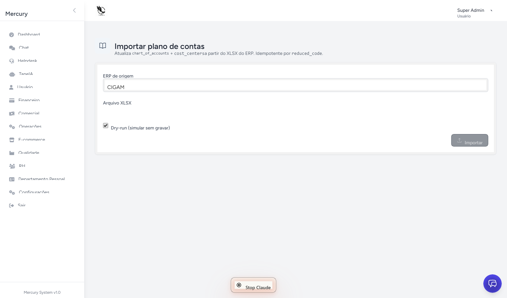
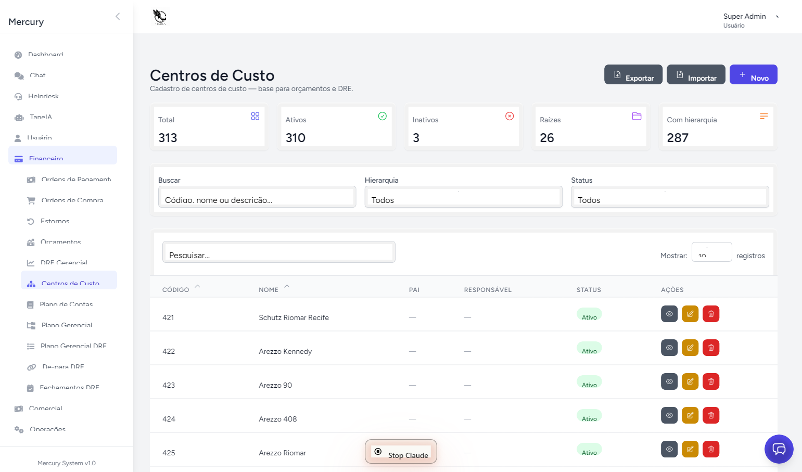
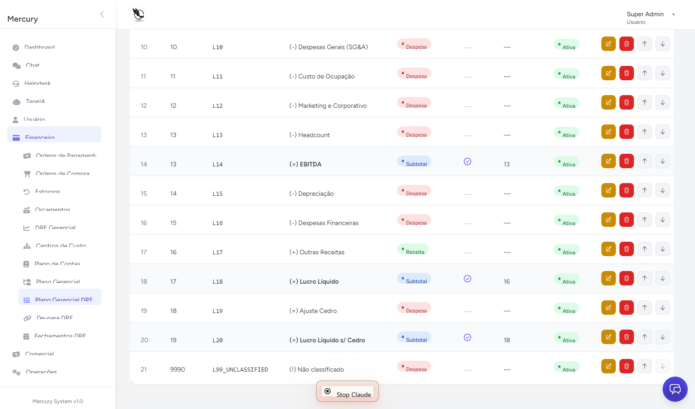
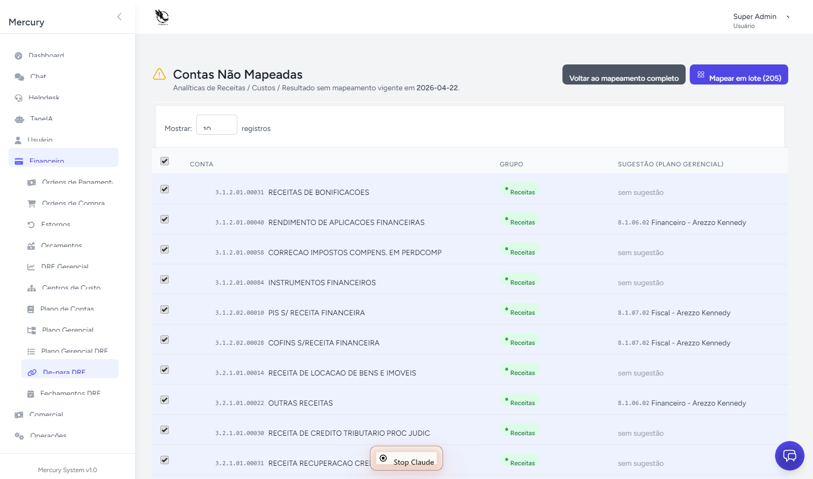
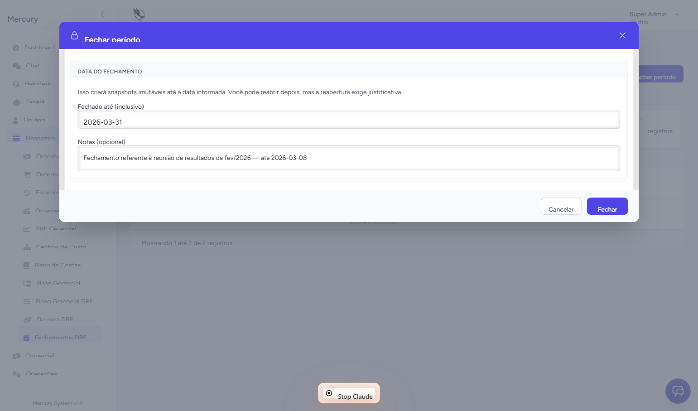
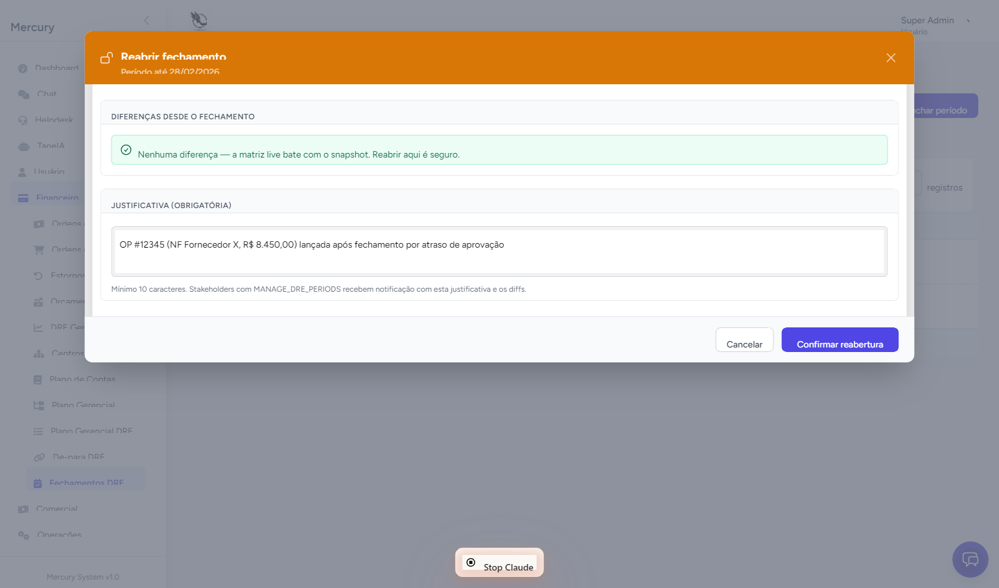
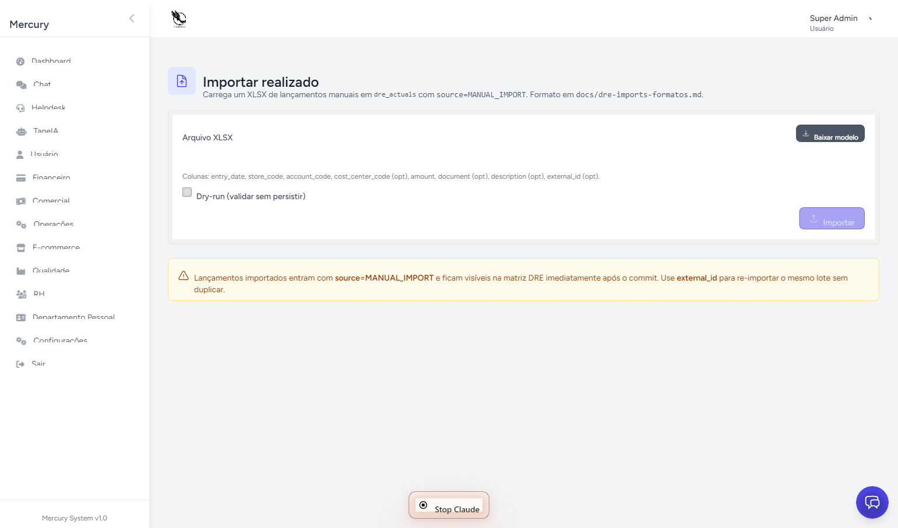

# 02 — Manual do Administrador da DRE

> Audiência: contador, financeiro responsável e admin SaaS.
> Pré-requisito: ter `dre.manage_*` ou ser **SUPER_ADMIN**/**ADMIN**.
> Para conceitos, veja [04 — Glossário](04-glossario.md).
> Para arquitetura, veja [01 — Arquitetura](01-arquitetura.md).

---

## Sumário

1. [Antes de começar](#1-antes-de-começar)
2. [Setup inicial — ordem rigorosa](#2-setup-inicial--ordem-rigorosa)
3. [Rotina mensal de fechamento](#3-rotina-mensal-de-fechamento)
4. [Importação manual de realizado](#4-importação-manual-de-realizado)
5. [Gestão de mapeamentos (de-para)](#5-gestão-de-mapeamentos-de-para)
6. [Gestão das 20 linhas executivas](#6-gestão-das-20-linhas-executivas)
7. [Permissions e responsabilidades](#7-permissions-e-responsabilidades)
8. [Troubleshooting](#8-troubleshooting)
9. [Recovery e comandos de emergência](#9-recovery-e-comandos-de-emergência)
10. [Notificações e audit log](#10-notificações-e-audit-log)

---

## 1. Antes de começar

Antes de mexer em qualquer coisa, garanta:

- **Acesso** ao tenant correto (subdomínio: `meia-sola.localhost:8000` em dev,
  domínio próprio em produção).
- **Login com role** `SUPER_ADMIN` ou `ADMIN` — só essas têm todas as
  permissions DRE por padrão. Se for `SUPPORT`, peça ao seu admin SaaS para
  atribuir as permissions específicas em `/admin/roles-permissions`.
- **Backup do banco** (em produção) antes de fazer setup inicial ou
  re-importação de plano de contas. O CIGAM importer usa upsert; em caso de
  bug, é mais rápido restaurar dump do que reverter manualmente.
- **Plano de contas em mãos** — XLSX com as colunas `code` e `name` (formato
  detalhado em [`docs/dre-plano-contas-formato.md`](../dre-plano-contas-formato.md)).


---

## 2. Setup inicial — ordem rigorosa

A DRE é um quebra-cabeças. **Cada peça depende da anterior.** Pular passos
gera erros silenciosos (linhas em zero, conta em L99, mapping rejeitado).

### Passo 1 — Importar o plano de contas

A DRE não funciona sem plano de contas. **Tudo começa aqui.**

**Opção A — Via UI (recomendada para volumes ≤ 5 mil contas):**

1. Vá em **Financeiro → Importar Plano de Contas** (`/dre/imports/chart`)
2. Selecione o XLSX exportado do CIGAM (ou outro ERP)
3. Marque **Dry-run** na primeira tentativa — valida sem gravar
4. Revise o relatório (linhas lidas, criadas, atualizadas, erros PT-BR)
5. Se OK, desmarque dry-run e clique **Importar**

**Opção B — Via terminal (recomendada para volumes maiores ou em produção):**

```bash
# Dry-run primeiro
php artisan dre:import-chart docs/Plano\ de\ Contas.xlsx --source=CIGAM --dry-run

# Se OK
php artisan dre:import-chart docs/Plano\ de\ Contas.xlsx --source=CIGAM
```

**O que essa importação faz:**

- Cria/atualiza `chart_of_accounts` (839 contas no caso Meia Sola)
- Cria/atualiza `cost_centers` (24 CCs no caso Meia Sola — códigos 421-457)
- Detecta hierarquia automaticamente (analítica vs sintética por nível do código)
- Atribui `account_group` por prefixo (1=Ativo, 2=Passivo, 3=Receita, 4=Despesa, 5=Custo)

**Erros comuns nessa etapa:**

| Erro | Causa | Solução |
|---|---|---|
| "Conta sem código" | Linha em branco no meio do XLSX | Limpe o arquivo, refaça |
| "account_group inválido" | Código fora do padrão `X.X.X.XX.XXXXX` | Renomeie no Excel ou ignore (ficará órfão) |
| "Conta duplicada" | Mesmo `code` em duas linhas | Manter só a versão mais recente |



### Passo 2 — Revisar centros de custo

A importação CIGAM já cria CCs, mas **revise** em
**Financeiro → Centros de Custo** (`/cost-centers`):

1. Confirme que cada loja tem CC próprio
2. Crie CCs internos se necessário (TI, Marketing, RH centralizado)
3. Defina hierarquia via `parent_id` quando fizer sentido
4. (Opcional) Configure `default_accounting_class_id` para CCs específicos —
   sugere conta padrão em formulários de OP



### Passo 3 — Revisar as 20 linhas executivas da DRE

Vá em **Financeiro → Plano Gerencial DRE** (`/dre/management-lines`).

A primeira instalação já vem com **20 linhas pré-cadastradas** — Receita Bruta,
(-) Devoluções, Receita Líquida, (-) CMV, Lucro Bruto, etc. **Você pode
renomear, reorganizar, mas não exclua nem mude o `code`.**

Ações mais comuns:

- **Renomear**: clique no ícone de edição da linha
- **Reordenar**: setas ↑/↓ + botão "Salvar ordem" (ordem afeta a apresentação,
  não o cálculo)
- **Marcar como subtotal**: edite a linha, ative `is_subtotal` e defina até
  qual `sort_order` ela acumula

**Não toque na L99_UNCLASSIFIED.** Ela é a linha-fantasma; sua existência é o
que evita quebrar a matriz quando alguma conta não tem mapping.



### Passo 4 — (Opcional) Cadastrar plano gerencial

Apenas se sua empresa **usa** vocabulário gerencial diferente do contábil
("Salário PJ" vs `4.2.1.04.00012`). Vá em **Financeiro → Plano Gerencial**
(`/management-classes`).

Para Meia Sola, são 169 classes no formato `8.1.DD.UU` (DD=departamento,
UU=uso). Esse cadastro **não impede** a DRE de funcionar — é vocabulário,
não motor.

### Passo 5 — Mapear contas → linhas DRE (de-para)

**Esta é a etapa que dá vida à DRE.** Sem mappings, todas as contas caem em
L99 e a matriz fica praticamente vazia.

Vá em **Financeiro → De-para DRE** (`/dre/mappings`).

**Workflow recomendado:**

1. Clique em **"Não mapeadas"** (`/dre/mappings/unmapped`) — vê todas as
   contas analíticas sem mapping vigente
2. Para cada conta, decida a linha DRE alvo
3. Use **"Atribuir em massa"** (`BulkAssignModal`) quando várias contas
   compartilham a mesma linha (ex: todas as `4.2.1.04.*` → "(-) Despesas
   Administrativas")
4. Mappings podem ser:
   - **Específicos**: `chart_of_account + cost_center` — usa quando uma conta
     se comporta diferente em CCs diferentes (raro)
   - **Coringa**: `chart_of_account` apenas (`cost_center=NULL`) — vale para
     qualquer CC. **Caso comum.**
5. Defina `effective_from` (data de início da vigência)
6. Deixe `effective_to` em branco (vigência aberta)

**Quando usar `effective_to`:**
- Reorganização de linha DRE (a partir de jan/2027 a conta vai para outra linha)
- Conta descontinuada (não receberá mais lançamentos a partir de uma data)

**Precedência (importante):** específico **vence** coringa. Se você tem
mapping coringa para a conta `4.2.1.04.00032 (Telefonia)` apontando para
"Despesas Administrativas" e cria um mapping específico para essa conta + CC
`421` apontando para "Despesas de Loja", o CC `421` vai para "Loja" e os
demais CCs continuam em "Administrativas".



### Passo 6 — Validação final

Após mapear, verifique:

```bash
# Deve listar linhas em L99 com seus respectivos valores
# Idealmente vazio ou só contas residuais
```

Acesse **Financeiro → DRE Gerencial** (`/dre/matrix`). A matriz deve mostrar
valores realistas. **Se L99 tem valor expressivo, há contas sem mapping.**
Volte ao Passo 5.

---

## 3. Rotina mensal de fechamento

### 3.1 Quando fechar

Padrão de mercado: **fechar o mês entre dia 5 e dia 10 do mês seguinte**, após:

- Sincronização CIGAM completa (vendas do mês fechado)
- Lançamento de OPs do mês fechado
- Ativação do orçamento do mês (se ainda não ativo)
- Lançamento de ajustes manuais (depreciação, IRPJ, provisões — ver §4)

### 3.2 Como fechar

1. Vá em **Financeiro → Fechamentos DRE** (`/dre/periods`)
2. Confira o **"Último fechamento ativo"** no topo (data inclusiva do último mês fechado)
3. Clique em **"Fechar período"** (botão primário no header)
4. No modal, **"Fechado até (inclusivo)"** já vem preenchido com o último dia do
   mês seguinte ao último fechamento (ex: fechou jan, modal sugere `2026-02-28`)
5. Adicione **Notas** (opcional) — recomendado: número da reunião de aprovação,
   ata, ou observação do contador
6. Confirme

**O que acontece tecnicamente:**

- Snapshot imutável dos valores de **todas as 20 linhas × 12 meses × cada
  escopo** (Geral + Rede + cada Loja) é gravado
- A partir desse momento, qualquer lançamento retroativo continua sendo
  projetado em `dre_actuals`, mas **a matriz não muda visualmente** para os
  meses fechados (overlay via snapshot)
- Importações manuais de realizado **rejeitam** datas dentro do período
  fechado



### 3.3 Quando reabrir

Reabertura é **rara** e auditada. Cenários legítimos:

- Erro contábil identificado pós-fechamento
- Lançamento de OP esquecido com valor relevante
- Ajuste solicitado pelo conselho/auditoria
- Conciliação retroativa de extrato

**Não reabra por** ajuste de centavos ou diferença trivial — reabertura
notifica todos com `dre.manage_periods` e fica em audit log.

### 3.4 Como reabrir

1. Em **Fechamentos DRE**, na linha do último fechamento ativo, clique em
   **"Reabrir"** (só aparece para o último ativo)
2. **Aguarde o preview de diffs** — sistema compara snapshot × matriz live
   atual e mostra todas as células que mudariam
3. Revise o diff:
   - **0 diferenças** = reabrir é seguro, valores não vão mudar
   - **N diferenças** = lançamentos retroativos foram feitos; após reabrir, o
     valor live (com esses lançamentos) vira oficial
4. Preencha **"Justificativa"** (mínimo 10 caracteres, máximo 500). Seja
   específico — vai para notificação e audit:
   - ❌ "Ajuste"
   - ✅ "OP #12345 (NF Fornecedor X, R$ 8.450,00) lançada após fechamento por
     atraso de aprovação"
5. Confirme

**Após reabrir:**

- Snapshots desse fechamento são apagados
- O período volta a ser computado live
- Notificação por mail+database vai para todos com `dre.manage_periods`
  (exceto você)
- Para fechar de novo, repita o §3.2 — sistema pede confirmar a mesma data
  ou data nova



---

## 4. Importação manual de realizado

### 4.1 Quando usar

Use quando o lançamento **não vem pelo CIGAM** (que alimenta `Sale`) **nem
pelo módulo Order Payments**. Exemplos:

- **Depreciação** mensal de ativo imobilizado
- **IRPJ/CSLL** de apuração trimestral
- **Provisões** (férias, 13º, contingências)
- **Conciliação manual** de extrato bancário com despesa
- **Custo contábil externo** (folha de pagamento processada por escritório)

**Não use** para despesas operacionais regulares — essas devem entrar pelo
módulo OP (que tem audit, aprovação, conciliação CIGAM).

### 4.2 Onde acessar

A partir de 2026-04-22, o "Importar Realizado DRE" **não está mais na sidebar**.
Acesso:

1. Vá em **Fechamentos DRE** (`/dre/periods`)
2. No header, clique em **"Importar realizado"** (botão secundário, ao lado
   de "Fechar período")
3. (Permission necessária: `dre.import_actuals`)



### 4.3 Formato do XLSX

Clique em **"Baixar modelo"** na própria tela para obter um XLSX pronto com
exemplos. Colunas:

| Coluna | Obrigatório? | Observação |
|---|---|---|
| `entry_date` | Sim | Formato `YYYY-MM-DD`. Não pode estar dentro de período fechado |
| `store_code` | Sim | Código da loja (`Z421`, `Z425`...) ou código corporativo |
| `account_code` | Sim | Conta contábil **analítica** (ex: `4.2.1.04.00032`) |
| `cost_center_code` | Não | CC vinculado |
| `amount` | Sim | Valor positivo. Sinal é aplicado pelo sistema conforme `account_group` |
| `document` | Não | NF, recibo, contrato (até 60 chars) |
| `description` | Não | Memo (até 500 chars) |
| `external_id` | Não | **Use para dedup**. Re-importar com mesmo `external_id` substitui a linha anterior |

**Convenção de sinal:** envie sempre o **valor absoluto positivo**. Sistema
aplica negativo automaticamente para contas de Despesa (grupo 4) e Custo
(grupo 5). Conta de Receita (grupo 3) mantém positivo.

### 4.4 Processo

1. Baixe o modelo
2. Preencha (até ~5 mil linhas — acima disso, prefira o command CLI)
3. Volte para a tela
4. Selecione o arquivo
5. **Marque "Dry-run"** na primeira tentativa
6. Clique **"Validar arquivo"**
7. Revise o relatório:
   - **Lidas** (total de linhas)
   - **Criadas / Atualizadas** (zero em dry-run)
   - **Erros** (PT-BR, com número da linha do XLSX)
8. Se OK, desmarque dry-run e clique **"Importar"**

### 4.5 Re-importação e dedup

- **Sem `external_id`**: cada importação é tratada como acréscimo. Re-importar
  o mesmo arquivo **duplica os lançamentos**.
- **Com `external_id`**: dedup por `(source=MANUAL_IMPORT, external_id)`. Re-
  importar substitui a linha anterior. **Recomendado para imports que se
  repetem** (depreciação mensal: `external_id = 'DEPREC-2026-04-LOJA-Z421'`).

### 4.6 Via CLI (massa)

Para arquivos > 5 mil linhas ou execução em background:

```bash
php artisan dre:import-actuals storage/app/imports/depreciacao-2026-04.xlsx --dry-run
php artisan dre:import-actuals storage/app/imports/depreciacao-2026-04.xlsx
```

---

## 5. Gestão de mapeamentos (de-para)

### 5.1 Workflow do contador

A DRE Gerencial só faz sentido se **todas as contas analíticas relevantes
estão mapeadas**. O workflow é:

```mermaid
flowchart LR
    A[Importar plano de contas] --> B[/dre/mappings/unmapped]
    B --> C{Conta nova?}
    C -->|Sim| D[Decidir linha DRE alvo]
    D --> E[Bulk assign ou create individual]
    E --> F[Vigência: effective_from]
    F --> G[Salvar]
    G --> B
    C -->|Não, já tudo mapeado| H[L99 vazio]
    H --> I[Matriz pronta]
```

### 5.2 Ferramentas disponíveis

- **Lista principal** (`/dre/mappings`): todos os mappings vigentes ou
  histórico, com filtros (`account_group`, `cost_center`, `management_line`,
  só não-mapeadas)
- **Edit inline**: cada linha tem dropdown de "Linha gerencial" — trocar
  salva imediatamente (PUT)
- **Bulk assign** (`BulkAssignModal`): selecione N contas, escolha 1 linha,
  aplica em todas
- **Não mapeadas** (`/dre/mappings/unmapped`): lista contas analíticas com
  movimento mas sem mapping vigente — sua queue de trabalho

### 5.3 Quando criar mapping específico vs coringa

| Situação | Tipo |
|---|---|
| Conta `4.2.1.04.00032 (Telefonia)` sempre vai pra "Despesas Administrativas" | **Coringa** (`cost_center=NULL`) |
| Conta `4.2.1.04.00032` em **CC 421 (Loja Centro)** vai pra "Despesas de Loja", nas demais vai pra "Administrativas" | **Específico** para `(account, CC=421) → Loja`, **+ coringa** para `(account, *) → Administrativas` |
| Mesma conta usada por todos com mesmo destino | **Coringa** sempre |

A regra de ouro: **comece com coringa**, crie específico só se aparecer
exceção.

### 5.4 Mudança de classificação no meio do ano

Cenário: a partir de julho, mover "Frete sobre vendas" de "(-) CMV" para
"(-) Despesas Comerciais".

1. Encontre o mapping atual da conta de frete
2. Edite e defina `effective_to = 2026-06-30`
3. Crie mapping novo: mesma conta, `effective_from = 2026-07-01`, linha alvo
   nova, `effective_to` vazio
4. Salve

A matriz do 1º semestre continua mostrando frete em CMV; do 2º semestre em
diante, em Despesas Comerciais. **Sem rebuild** — o `DreMappingResolver`
escolhe o mapping certo conforme `entry_date`.

---

## 6. Gestão das 20 linhas executivas

### 6.1 Estrutura padrão

A instalação cria 20 linhas (códigos `L01` a `L99_UNCLASSIFIED`).
Aproximadamente:

| Code | Nome | Tipo |
|---|---|---|
| L01 | Receita Bruta | revenue |
| L02 | (-) Devoluções e Cancelamentos | revenue (negativo) |
| L03 | (-) Impostos sobre Vendas | revenue (negativo) |
| L04 | **Receita Líquida** | subtotal (L01..L03) |
| L05 | (-) CMV | cost |
| L06 | **Lucro Bruto** | subtotal |
| L07–L10 | Despesas operacionais (admin, comercial, pessoal, ocupação) | expense |
| L11 | **EBITDA** | subtotal |
| L12 | (-) Depreciação/Amortização | expense |
| L13 | (-) Despesas Financeiras Líquidas | expense |
| L14 | **Lucro Operacional** | subtotal |
| L15..L18 | Outros resultados, IR/CSLL | varied |
| L20 | **Lucro Líquido** | subtotal |
| L99_UNCLASSIFIED | (Não classificado) | fallback |

(O cadastro real pode variar — consulte `/dre/management-lines`.)

### 6.2 Boas práticas

- **Não exclua linhas em produção.** Se quiser eliminar, marque `is_active=false`
  ou aponte mappings para outra linha.
- **Mantenha `code` estável.** Renomear o `name` é seguro; mudar `code` quebra
  histórico.
- **Subtotal precisa de `accumulate_until_sort_order` correto.** Se o EBITDA
  acumula até L10, garanta que L10 tem `sort_order` consistente.
- **Use `nature` corretamente** (revenue/expense/cost/subtotal) — UI usa para
  validar que mappings de despesa não vão pra linha de receita.

---

## 7. Permissions e responsabilidades

| Permission | Quem deve ter | O que libera |
|---|---|---|
| `dre.view` | Todos os consumidores (gerentes, sócios, contador) | Acessar matriz e drill |
| `dre.export` | Quem precisa baixar relatório | Botões XLSX/PDF na matriz |
| `dre.manage_structure` | Contador, admin SaaS | CRUD das 20 linhas executivas |
| `dre.manage_mappings` | Contador | CRUD do de-para conta→linha |
| `dre.view_pending_accounts` | Contador | Ver lista L99 (`/dre/mappings/unmapped`) |
| `dre.import_actuals` | Contador | Importar realizado manual + acessar botão em Fechamentos |
| `dre.manage_periods` | Contador, admin SaaS | Fechar/reabrir períodos |

`dre.import_budgets` existe no enum mas a UI foi removida — fica acessível
apenas via `dre:import-budgets` no terminal.

**Atribuição:** vá em `/admin/roles-permissions`, escolha a role e marque as
permissions desejadas. SUPER_ADMIN e ADMIN recebem todas por padrão (vem do
Role enum). SUPPORT recebe só `dre.view`.

---

## 8. Troubleshooting

### "Linha L99 com valor"

**Sintoma:** matriz mostra valor expressivo na linha vermelha "Não
classificado".

**Causa:** existem contas com lançamentos em `dre_actuals`/`dre_budgets` sem
mapping vigente para a data dos lançamentos.

**Solução:**
1. Vá em `/dre/mappings/unmapped`
2. Liste as contas pendentes
3. Crie mapping (coringa ou específico) para cada uma
4. Aguarde até 10 minutos (TTL do cache) ou rode
   `php artisan dre:warm-cache` para forçar atualização

### "Erro: Conta contábil de grupo 1 (Ativo) não pode projetar para DRE"

**Sintoma:** OrderPayment ao salvar gera `DomainException`. Aparece em
`storage/logs/laravel-YYYY-MM-DD.log`.

**Causa:** OP foi criada apontando para conta de **Ativo** (grupo 1) ou
**Passivo** (grupo 2). DRE só aceita Receita (3), Despesa (4) e Custo (5).

**Solução:** edite a OP, troque a conta para uma analítica de resultado (3, 4
ou 5). Se a OP é correta e refere-se mesmo a movimento patrimonial, esse
lançamento **não deve aparecer na DRE** — registre-o por outro caminho
(módulo de imobilizado, contas a pagar) sem disparar projeção DRE.

### "Importação rejeitou data: dentro de período fechado"

**Sintoma:** XLSX de import retorna erro `"entry_date (YYYY-MM-DD) dentro de
período fechado (YYYY-MM-DD). Reabra o período antes de importar."`

**Causa:** você está tentando lançar em mês já fechado.

**Solução:** três opções:
1. **Lançar no mês corrente** (ajuste retroativo via documento de competência
   atual)
2. **Reabrir o fechamento** (§3.4), importar, fechar de novo
3. **Lançar via OP** (não bloqueia) — mas a matriz dos meses fechados não
   refletirá o ajuste até reabrir

### "Matriz lenta no primeiro acesso da manhã"

**Sintoma:** primeira abertura da matriz demora >5s, próximas são instantâneas.

**Causa:** cache file expirou (TTL 600s). Warm-up (`dre:warm-cache`) está
agendado para 05:50 — se o servidor estava desligado, não rodou.

**Solução:**
- Garantir que o `php artisan schedule:run` está agendado no cron do servidor
- Rodar manualmente: `php artisan dre:warm-cache` antes do expediente

### "Conta não aparece quando tento criar mapping"

**Sintoma:** autocomplete de "Conta contábil" não retorna a conta procurada.

**Causa:** conta está como `synthetic` (agrupadora) — só `analytical` aceita
mapping.

**Solução:** mappings devem ir para a conta filho (analítica) que receberá o
lançamento, não para a agrupadora.

### "Valor errado na matriz, mas no drill aparece certo"

**Sintoma:** total de uma célula difere do que se vê ao clicar pra fazer
drill.

**Causa:** cache stale (raro — invalidação é automática) **ou** mapping
mudou recentemente e cache não invalidou.

**Solução:** rode `php artisan dre:warm-cache` e atualize a página. Se
persistir, abra issue.

### "Reabri o fechamento e a matriz continua igual"

**Sintoma:** após reabrir, valores de meses reabertos parecem inalterados.

**Causa:** **isso é o comportamento esperado se não houver lançamento
retroativo.** O preview de diffs já mostrou "0 diferenças".

**Solução:** se você esperava ver algum lançamento aparecer, confirme que ele
foi criado no `entry_date` correto e que não está em outro período fechado
ainda ativo.

---

## 9. Recovery e comandos de emergência

### Re-projetar todos os lançamentos

Cenário: bug em projetor foi corrigido, ou houve mudança massiva em mappings,
ou contagem está claramente errada.

```bash
# Reprojeta tudo (todas as sources)
php artisan dre:rebuild-actuals

# Só vendas
php artisan dre:rebuild-actuals --source=SALE

# Só despesas
php artisan dre:rebuild-actuals --source=ORDER_PAYMENT
```

**Idempotente** — pode rodar quantas vezes quiser, produz o mesmo estado
final em `dre_actuals`. Linhas com `source=MANUAL_IMPORT` **não são afetadas**
(elas não têm projetor).

### Re-aquecer cache imediatamente

```bash
php artisan dre:warm-cache
```

### Re-importar plano de contas (atualização)

Quando o ERP muda contas (criação, exclusão, mudança de hierarquia):

```bash
php artisan dre:import-chart docs/Plano\ de\ Contas\ atualizado.xlsx --source=CIGAM
```

Upsert por `code`. Não apaga contas ausentes do XLSX (proteção contra erro
humano). Para apagar, vá ao CRUD `/accounting-classes`.

### Restaurar de snapshot (em caso de catástrofe)

Se a tabela `dre_actuals` for corrompida:

```bash
# 1. Restaurar dump de banco do dia anterior
# 2. Re-projetar os lançamentos do dia
php artisan dre:rebuild-actuals
```

`dre_actuals` é **derivada** — sempre pode ser recomputada de Sale + OP +
arquivos de import (se você os mantiver versionados).

---

## 10. Notificações e audit log

### Notificações automáticas

| Evento | Quem é notificado | Canal |
|---|---|---|
| Reabertura de período | Todos com `dre.manage_periods` (exceto quem reabriu) | mail + database |

### Audit log

Todos os models DRE relevantes têm o trait `Auditable`:

- `DreManagementLine` — alterações em linhas executivas
- `DreMapping` — alterações em mappings (criação, edição, exclusão)
- `BudgetUpload` — atividade de orçamento (ver manual de Orçamentos)

Audit visível em **Configurações → Logs de atividade** (`/activity-logs`).
Filtre por `model_type` para ver só DRE.

### O que **não** está no audit

- Lançamentos em `dre_actuals` (volume alto, ruído). Use `source` + `source_id`
  para rastrear de onde veio.
- Snapshots em `dre_period_closing_snapshots` — são o próprio audit imutável
  do fechamento.

---

## Referência rápida

**Setup inicial em 5 comandos:**
```bash
php artisan dre:import-chart docs/Plano\ de\ Contas.xlsx --source=CIGAM
# (UI: /cost-centers para revisar)
# (UI: /dre/management-lines para revisar 20 linhas)
# (UI: /dre/mappings/unmapped para mapear contas → linhas)
php artisan dre:warm-cache
# Conferir em /dre/matrix
```

**Rotina mensal em 1 comando:**
```bash
# Após sincronização CIGAM completa, OPs lançadas, ajustes feitos
# UI: /dre/periods → "Fechar período"
```

**Recuperação de erro:**
```bash
php artisan dre:rebuild-actuals && php artisan dre:warm-cache
```

---

> **Última atualização:** 2026-04-22
