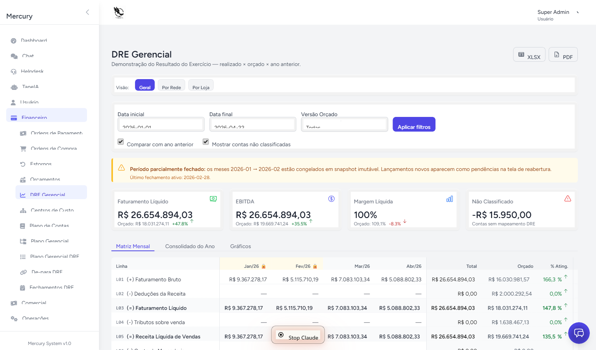
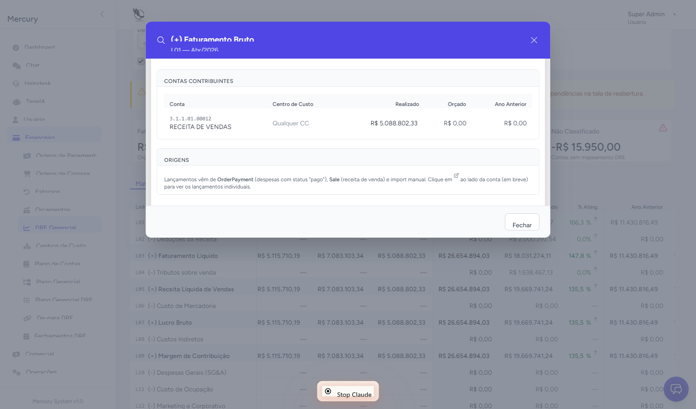
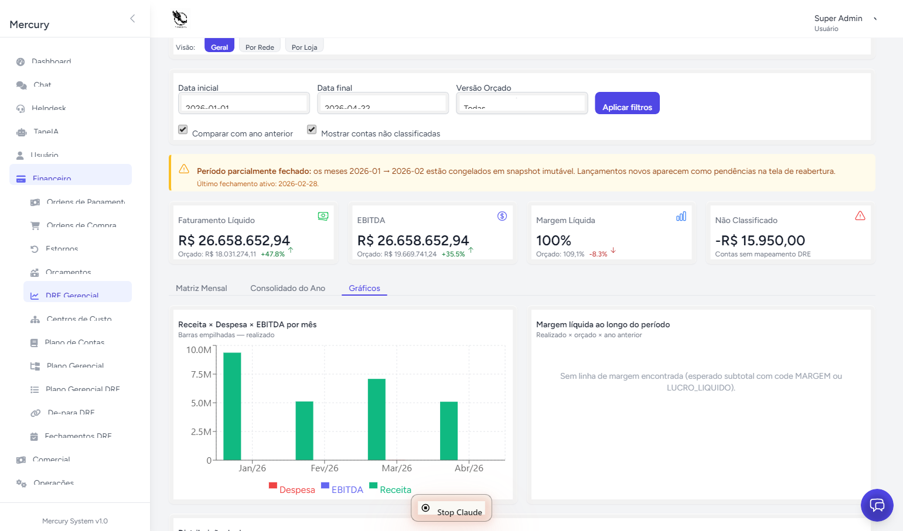

# 03 — Manual do Usuário Final da DRE

> Audiência: gerentes, diretores, sócios e demais leitores do relatório.
> Pré-requisito: ter a permission `dre.view` (qualquer role exceto USER por padrão).
> Para configurar a DRE, veja [02 — Manual do administrador](02-administrador.md).
> Para conceitos, veja [04 — Glossário](04-glossario.md).

---

## Sumário

1. [O que é a DRE Gerencial](#1-o-que-é-a-dre-gerencial)
2. [Como acessar](#2-como-acessar)
3. [Anatomia da matriz](#3-anatomia-da-matriz)
4. [Filtros disponíveis](#4-filtros-disponíveis)
5. [Como ler os valores](#5-como-ler-os-valores)
6. [Drill — investigar uma célula](#6-drill--investigar-uma-célula)
7. [As três visões: Mensal, Anual, Gráficos](#7-as-três-visões-mensal-anual-gráficos)
8. [Exportar para XLSX e PDF](#8-exportar-para-xlsx-e-pdf)
9. [Perguntas frequentes](#9-perguntas-frequentes)

---

## 1. O que é a DRE Gerencial

A **DRE (Demonstração de Resultados do Exercício) Gerencial** é o relatório
que mostra **quanto a empresa ganhou e gastou em cada mês**, organizado em
linhas que vão da **Receita Bruta** até o **Lucro Líquido**.

A versão "Gerencial" se diferencia da DRE contábil porque:

- **Foi desenhada para decisão**, não para fisco. As linhas são as que a
  diretoria quer ver, não as que o CFC obriga.
- Mostra **realizado e orçado lado a lado** — você vê o que aconteceu e o que
  era planejado.
- Permite **filtrar por loja, rede ou consolidado** — o mesmo relatório serve
  para o gerente da loja Z421 e para a diretoria.
- Permite **clicar numa célula e ver os lançamentos que formaram aquele
  número** (drill).


---

## 2. Como acessar

1. Faça login em `https://[seu-tenant].mercury.com`
2. No menu lateral, clique em **Financeiro → DRE Gerencial**
3. Ou acesse direto: `/dre/matrix`

A primeira abertura do dia pode demorar 2-3 segundos (sistema está
carregando os dados); a partir da segunda, é instantânea.

---

## 3. Anatomia da matriz

A matriz tem **linhas** (categorias do resultado) e **colunas** (períodos).

### Linhas

Existem **20 linhas executivas**, do tipo:

| Tipo | Exemplo | Como aparece |
|---|---|---|
| **Linha de detalhe** | "Receita Bruta", "Despesas Administrativas" | Linha normal, fonte regular |
| **Subtotal** | "Receita Líquida", "Lucro Bruto", "EBITDA", "Lucro Líquido" | **Negrito**, fundo cinza claro |
| **Linha vermelha** | "Não Classificado" (L99) | **Fonte vermelha**, só aparece se houver pendência |

> A linha **"Não Classificado"** sinaliza que existem despesas/receitas que
> ainda não foram categorizadas. Se aparecer com valor, **avise o contador**.
> Para você, leitor, é informação: aquele valor existe mas não está alocado
> em nenhuma categoria.

### Colunas

Dependem da **visão escolhida** (ver §7):

- **Visão Mensal**: 1 coluna por mês (até 12 meses do ano corrente)
- **Visão Anual**: 1 coluna com o total do ano
- Cada célula mostra **Realizado** e (quando há orçamento ativo) **Orçado** e
  **Variação** (R$ e %)

---

## 4. Filtros disponíveis

No topo da matriz, encontre os filtros:



### Período

- **Ano**: selecione o ano (padrão: ano corrente)
- **De / Até**: limite o range de meses (padrão: janeiro a mês atual)

### Escopo

Define **o que** está sendo somado:

- **Geral**: consolidado da empresa toda (todas as redes, todas as lojas)
- **Rede**: filtra por rede (ex: "Comercial", "E-commerce")
- **Loja**: filtra por uma loja específica (ex: `Z421`, `Z425`)

> Útil: para ver a comparação entre lojas, abra o relatório uma vez para
> cada loja em abas separadas do navegador.

### Versão de orçamento

Lista as versões de orçamento ativas. Padrão: a **versão ativa do escopo
selecionado**. Se houver várias versões em paralelo (ex: `2026.v1` e
`2026.v2`), você pode trocar para comparar.

> Se o filtro de versão mostrar **"Sem orçado"**, é porque o módulo de
> Orçamentos não tem versão ativa para o escopo. A coluna de orçado fica
> vazia, mas a coluna de realizado continua funcionando.

### Aplicar / Limpar

- Clique **"Aplicar"** após mudar qualquer filtro (não atualiza
  automaticamente para evitar reload pesado)
- Clique **"Limpar"** para voltar aos defaults

---

## 5. Como ler os valores

### Sinais

A matriz exibe **valores com sinal**, no padrão DRE clássica:

- **Receitas**: positivos (sem sinal)
- **Despesas e custos**: negativos (com sinal `-` ou entre parênteses)
- **Subtotais e lucros**: podem ser positivos (lucro) ou negativos (prejuízo)

### Cores

| Cor | Significado |
|---|---|
| **Preto / cinza escuro** | Valor neutro |
| **Verde** | Variação positiva favorável (receita acima do orçado, despesa abaixo do orçado) |
| **Vermelho** | Variação negativa desfavorável (receita abaixo, despesa acima) |
| **Cinza claro** | Linha de subtotal |

### Variação

Ao lado de cada célula com orçado, aparece a variação:

- **R$**: diferença em reais entre realizado e orçado
- **%**: percentual da diferença

Exemplo:
```
Despesas Administrativas
Realizado: 18.500,00
Orçado:    16.000,00
Variação:  (2.500,00)  +15,6%
```

A variação `+15,6%` em **vermelho** indica que gastou mais que o orçado
(desfavorável para despesa).

---

## 6. Drill — investigar uma célula

A "drill" é o recurso mais útil para **entender de onde vem um número**.

### Como usar

1. **Clique numa célula da matriz** (qualquer linha que não seja subtotal)
2. Abre um modal listando **cada lançamento** que formou aquele valor:
   - Data
   - Loja
   - Conta contábil
   - Centro de custo
   - Valor
   - Documento (NF, recibo)
   - Origem (Venda CIGAM, Despesa OP, Importação manual)
   - Descrição



### Ações no drill

- **Ordenar** clicando em qualquer cabeçalho de coluna
- **Filtrar** por busca livre no campo do topo
- **Exportar** os lançamentos visíveis em XLSX (botão no canto)

### Linhas de subtotal não fazem drill

Subtotais (Lucro Bruto, EBITDA, Lucro Líquido) são **calculados** a partir
de outras linhas — não há lançamento "diretamente" neles. Para investigar
um subtotal, abra as linhas que o compõem.

---

## 7. As três visões: Mensal, Anual, Gráficos

A matriz tem **três abas** no topo, lado a lado:

### Aba "Mensal"

Padrão. Mostra **uma coluna por mês** dentro do range selecionado.
Útil para ver tendência ao longo do ano.

### Aba "Anual"

Consolida tudo em **uma coluna só** com o total do ano. Útil para apresentar
em reunião de fechamento anual ou para comparar contra o orçado anual.

### Aba "Gráficos"

Mostra:

- **Gráfico de barras**: Receita × Despesa × Lucro Líquido por mês
- **Gráfico de linha**: evolução do EBITDA mês a mês
- **Gráfico de pizza**: composição de despesas (top 5 categorias)
- **Indicadores**: Margem Bruta %, Margem EBITDA %, Margem Líquida %



Os gráficos respondem aos mesmos filtros — mude período/escopo e os gráficos
acompanham.

---

## 8. Exportar para XLSX e PDF

### XLSX

1. Clique em **"Exportar XLSX"** no topo direito
2. O download começa imediatamente
3. O arquivo tem **3 abas**:
   - **Mensal**: matriz com 12 meses + totais
   - **Anual**: visão consolidada
   - **Detalhamento**: todos os lançamentos do período (útil para auditoria)

> Permission necessária: `dre.export`. Se o botão não aparece, peça ao
> administrador.

### PDF

1. Clique em **"Exportar PDF"** no topo direito
2. Gera um PDF formatado para impressão A4 paisagem
3. Inclui filtros aplicados no cabeçalho (data, escopo, versão de orçamento)

> Use o PDF para anexar em ata, enviar por email a sócios ou imprimir
> para reunião física. **Não edite o PDF** — se precisar alterar números,
> volte ao sistema, edite os lançamentos na origem (OP, Sale, etc.) e
> exporte de novo.

---

## 9. Perguntas frequentes

### "Os valores estão diferentes do que eu esperava. O que faço?"

1. **Confira os filtros**: escopo certo? Período certo? Versão de orçamento
   correta?
2. **Faça drill** na célula suspeita — verifique se os lançamentos batem com
   sua expectativa
3. Se algum lançamento parece errado, **vá à origem dele** (OP, Sale,
   importação) e corrija lá. A DRE atualiza automaticamente em até 10
   minutos.
4. Se persistir, fale com o contador (administrador).

### "Por que a coluna de Orçado está vazia?"

Significa que **não há orçamento ativo para o escopo + ano + versão**
selecionados. O administrador precisa subir uma versão pelo módulo
**Orçamentos** (`/budgets`) e ativá-la. Veja
[Manual de Orçamentos](../budgets/manual.md).

### "A linha 'Não Classificado' tem valor. Devo me preocupar?"

Para a leitura do relatório, sim — significa que parte das despesas/receitas
não está alocada. **Avise o contador** — ele precisa criar mappings para
essas contas em `/dre/mappings/unmapped`. Após mapear, o valor sai de "Não
Classificado" e vai para a linha correta automaticamente.

### "Posso ver dados de meses anteriores ao ano corrente?"

Sim. Use o filtro **Ano** no topo. Histórico está disponível desde o início
da operação no Mercury (não há limite de retenção).

### "Por que o lucro do mês está diferente do que vi semana passada?"

Possíveis razões legítimas:

- Lançamentos retroativos (OP de fornecedor lançada após você ter visto)
- Sincronização CIGAM trouxe vendas adicionais (ajuste de invoice)
- Importação manual de ajuste contábil (depreciação, IRPJ)

Se o mês está **fechado** (período encerrado pelo contador), o valor não
muda mais — o relatório mostra o snapshot daquela data. Se o mês ainda está
aberto, oscila com novos lançamentos.

### "Posso editar valores diretamente na matriz?"

Não. A matriz é **somente leitura**. Para mudar um valor, vá à origem do
lançamento:

- **Vendas**: ajuste no CIGAM (sincronização traz o ajuste)
- **Despesas**: edite a OP em `/order-payments`
- **Orçamentos**: edite no módulo `/budgets`
- **Ajustes manuais**: edite em `/dre/imports/actuals` (acesso restrito)

### "O que significa cada linha?"

Veja a tabela completa em [04 — Glossário](04-glossario.md), seção "Linhas
da DRE".

### "Posso compartilhar uma URL específica da matriz?"

Sim. Os filtros vão na URL. Copie a URL atual e quem tiver permissão de
acesso vai ver a mesma visão.

### "Como sei se uma versão de orçamento está ativa?"

No módulo **Orçamentos** (`/budgets`), versões ativas têm um badge verde
**"ATIVO"**. Na matriz, só aparecem no dropdown de filtro versões que estão
ativas para o escopo selecionado.

---

## Atalhos úteis

| Atalho | Ação |
|---|---|
| Clique na célula | Abre drill |
| `Ctrl + clique` em filtro | Aplica filtro mantendo demais filtros |
| `Esc` no modal de drill | Fecha drill |

---

> **Última atualização:** 2026-04-22
