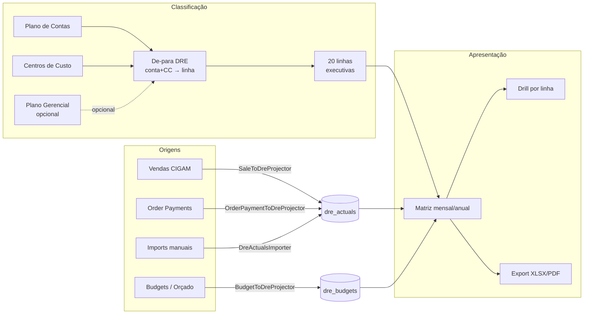

# Módulo DRE — Documentação

Esta pasta concentra a documentação **orientada ao produto pronto** do módulo DRE
(Demonstração de Resultados do Exercício) Gerencial do Mercury.

Para documentação de **desenvolvimento** (playbook de implementação, descoberta,
status de execução, formato de imports), veja a pasta raiz [`docs/`](../) — em
particular `dre-playbook.md`, `dre-arquitetura.md` (rascunho técnico) e
`dre-imports-formatos.md`.

> [SCREENSHOT: tela principal da matriz DRE com filtros aplicados]

---

## Para quem é cada documento

| Documento | Para quem | Quando ler |
|---|---|---|
| [01 — Arquitetura](01-arquitetura.md) | Devs, mantenedores | Antes de mexer em código DRE ou em algum dos 5 módulos satélites |
| [02 — Manual do administrador](02-administrador.md) | Contador, financeiro, admin SaaS | No setup inicial, na rotina mensal de fechamento e em incidentes |
| [03 — Manual do usuário final](03-usuario-final.md) | Gerente, diretoria, sócios | Para consumir a matriz: filtrar, fazer drill, exportar |
| [04 — Glossário](04-glossario.md) | Todos | Quando bater dúvida sobre um termo (DRE Contábil × Gerencial, L99, source, etc.) |

Para o módulo de **Orçamentos** (que alimenta a coluna "Orçado" da DRE), veja a
documentação dedicada em [`docs/budgets/manual.md`](../budgets/manual.md).

---

## Visão de uma página

A DRE Gerencial do Mercury é uma **matriz mensal** com 20 linhas executivas
(Receita Bruta → Lucro Líquido), montada a partir de **lançamentos de origens
diversas** (vendas CIGAM, despesas do módulo Order Payments, orçados do módulo
Budgets, ajustes manuais) que são classificados em linhas via um **de-para
configurável**.

---

## Os 5 módulos satélites

| Módulo | Tabela | Papel | Doc |
|---|---|---|---|
| **Centros de Custo** | `cost_centers` | Hierarquia operacional (loja/dept/área). Onde o gasto aconteceu. | [/cost-centers](#) |
| **Plano de Contas** | `chart_of_accounts` | Plano contábil normativo (839 contas reais Meia Sola). Natureza débito/crédito. | [/accounting-classes](#) |
| **Plano Gerencial** | `management_classes` | Visão interna (169 classes). Bridge **opcional** entre operacional e contábil. | [/management-classes](#) |
| **Linhas Gerenciais DRE** | `dre_management_lines` | As 20 linhas fixas da DRE executiva. **Estrutura imutável do relatório.** | [/dre/management-lines](#) |
| **De-para DRE** | `dre_mappings` | Vincula `(conta + CC) → linha DRE`, com vigência (`effective_from/to`). | [/dre/mappings](#) |

Detalhes (FKs, validações, regras de negócio) em
[01 — Arquitetura](01-arquitetura.md), seção "Os 5 módulos satélites".

---

## Permissions (8)

| Slug | Quem precisa | Para |
|---|---|---|
| `dre.view` | Todos os consumidores da matriz | Acessar `/dre/matrix` e ler relatório |
| `dre.manage_structure` | Admin/contador | Editar as 20 linhas executivas |
| `dre.manage_mappings` | Admin/contador | Mapear conta → linha DRE |
| `dre.view_pending_accounts` | Admin/contador | Ver contas que caíram em **L99 — Não classificado** |
| `dre.import_actuals` | Admin/contador | Importar realizado manual (depreciação, IRPJ, ajustes) |
| `dre.import_budgets` | (apenas CLI) | Importar orçado manual — **UI removida**; usar `dre:import-budgets` |
| `dre.manage_periods` | Admin/contador | Fechar e reabrir períodos |
| `dre.export` | Quem exporta XLSX/PDF | Botões de export na matriz |

Atribuição padrão: SUPER_ADMIN e ADMIN recebem todas; SUPPORT recebe só
`dre.view`. Configurável em `/admin/roles-permissions`.

---

## Rotas principais

| Rota | Método | O que faz |
|---|---|---|
| `/dre/matrix` | GET | Matriz mensal (tela principal) |
| `/dre/matrix/drill/{line}` | GET | Drill — listagem de lançamentos de uma linha |
| `/dre/matrix/export/{xlsx,pdf}` | GET | Export da matriz |
| `/dre/management-lines` | GET/POST/PUT/DELETE | CRUD das 20 linhas executivas |
| `/dre/mappings` | GET/POST/PUT/DELETE | CRUD do de-para |
| `/dre/mappings/unmapped` | GET | Listagem de contas sem mapping (queue de trabalho) |
| `/dre/periods` | GET/POST/PATCH | Fechamentos e reaberturas |
| `/dre/imports/actuals` | GET/POST | Upload manual de realizado |
| `/dre/imports/actuals/template` | GET | Download do XLSX modelo |
| `/dre/imports/chart` | GET/POST | Upload do plano de contas (CIGAM/etc) |

Acesso ao **Importar realizado** é feito a partir de **Fechamentos DRE** (botão
secundário no header) — a partir de 2026-04-22 deixou de aparecer na sidebar.

---

## Commands agendados

| Command | Quando roda | O que faz |
|---|---|---|
| `dre:warm-cache` | Diariamente 05:50 | Pré-computa a matriz para o mês corrente — primeiro acesso do dia abre instantâneo |

Commands disponíveis sob demanda (sem schedule):

- `dre:import-chart <path> [--source=CIGAM]` — sobe plano de contas + CCs
- `dre:import-actuals <path> [--dry-run]` — sobe realizado manual em massa
- `dre:import-budgets <path> --version=<label> [--dry-run]` — sobe orçado manual em massa (alternativa excepcional ao módulo Budgets)
- `dre:rebuild-actuals` — reprojetar todos os actuals (recovery após mudança de mapping/projetor)

---

## Onde encontrar o quê (atalhos)

- **"Por que esse valor está estranho?"** → [02 — Administrador, seção *Troubleshooting*](02-administrador.md#troubleshooting)
- **"O que significa L99?"** → [04 — Glossário](04-glossario.md#l99--não-classificado)
- **"Como adiciono uma conta nova?"** → [02 — Administrador, seção *Setup*](02-administrador.md#setup-inicial)
- **"Como leio a matriz?"** → [03 — Usuário final](03-usuario-final.md)
- **"Quais campos vão no XLSX de import?"** → [`docs/dre-imports-formatos.md`](../dre-imports-formatos.md)
- **"Como funciona o cache?"** → [01 — Arquitetura, seção *Cache*](01-arquitetura.md#cache)

---

> **Última atualização:** 2026-04-22
> **Versão da DRE:** v1 (released 2026-04-22, ver `dre-execucao-status.md`)
